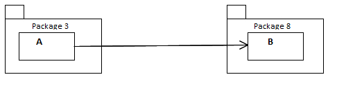

# Diseño de Sistemas Software

# Principios de Diseño de Paquetes/Componentes

[Uncle Bob Martin principles](http://butunclebob.com/ArticleS.UncleBob.PrinciplesOfOod)

## Granularidad

- Las aplicaciones crecen en tamaño y complejidad
- Se requiere algún tipo de organización
- La _clase_ es de un grano demasiado fino como unidad de organización

- En UML, Java y otros lenguajes se da el concepto de __paquete__ (*package*)
- En general puede hablarse de "agrupaciones lógiclas de declaraciones que pueden importarse en otros programas" (__componentes__)

### Preguntas

- ¿Mejor criterio de partición?
- ¿Qué relaciones hay entre paquetes y qué principios de diseño gobiernan su uso?
- ¿Los paquetes deben diseñarse antes que las clases, o al revés?
- ¿Cómo se representan físicamente los paquetes?
- ¿Para qué usaremos esos paquetes?

### Principio de Equivalencia de Reutilización/Entrega

__REP: *Reuse/Release Equivalence Principle*__

> The granule of reuse is the granule of release. Only components that are released through a tracking system can be effectively reused. This granule is the package.
> 
> -- Robert C. Martin

¿Se reuiliza código cuando se hace copia-pega?

Se reutiliza código si y sólo si no hace falta mirar el código fuente más allá de la parte pública del componente/biblioteca (ficheros de cabecera, etc.)

Es de esperar que el código a reutilizar se trate como un __producto__ en sí mismo, que no es mantenido ni distribuido por uno mismo (el consumidor o cliente), sino por el autor (o alguien delegado) responsable.

Se requiere que el autor distribuya/haga entregas regulares de distintas versiones del componente/biblioteca.

No se puede reutilizar algo que no haya sido liberado/entregado.

Un cliente de una biblioteca liberada lo es __de toda la biblioteca__, no de parte de ella.

REP ==> El grano de reutilización no puede ser menor que el grano de la entrega

### Principio de Reutilización en Común

__CRP: *Common Reuse Principle*__

> The classes in a package are reused together. If you reuse one of the classes in a package, you reuse them all.
> 
> -- Robert C.  Martin

¿Qué clases ubicar en cada paquete?

Las clases casi no se usan por separado, sino como parte de una __abstracción reutilizable__

CRP ==> Dicha abstracción debe ser un mismo paquete

Ejemplo: contenedor + iteradores

Cuando alguien decide usar un paquete, se crea una dependencia __sobre todo el paquete__. No es bueno tener que revalidar una aplicación porque hay que liberar o entregar una versión del paquete provocada por haber cambios en clases que no importan.

### Principio de Clausura Común

__CCP: *Common Closure Principle*__

> The classes in a package should be closed together against the same kinds of changes. A change that affects a package affects all the classes in that package.
>
> -- Robert C. Martin

La __mantenibilidad__ es más importante que la __reusabilidad__

Si hay que cambiar el código, ¿dónde es mejor que estén los cambios? ¿en un paquete o repartidos por varios paquetes?

CCP es un intento de tener junto todo lo que es probable que cambie por una misma razón

CCP muy conectado con OCP.

Como no es posible garantizar 100% el "cierre" de OCP...

el "cierre" debe ser estratégico ==> diseñar los sistemas para que estén cerrados a los cambios más probables que podamos anticipar.

### Principio de Dependencias Acíclicas

__ADPP: *Acyclic Dependencies Principle*__

> The dependency structure between packages must be a Directed Acyclic Graph (DAG). That is, there must be no cycles in the dependency structure
> 
> -- Robert C. Martin

Hay que particionar el entorno de desarrollo en paquetes "liberables" por separado.

Pero equipos de trabajo distribuidos harán cambios a cada paquete por separado, y esto puede inducir nuevas dependencias entre paquetes

Hay que __gestionar__ la estructura de dependencias de los paquetes

####Dependencia entre paquetes:

####Grafo de dependencias sin ciclos:

####Supongamos que añadimos una nueva dependencia package 3 ---> package 8

- Resolución vía DIP:

	

- Resolución vía paquete intermedio (package 9):

	

La segunda alternativa puede crear una estructura _"jitters"_ de dependencias entre paquetes.

## Información adicional

Leer más sobre [continuous delivery](https://en.wikipedia.org/wiki/Continuous_delivery) y herramientas de [continuous integration](https://en.wikipedia.org/wiki/Continuous_integration):

- Ejemplo: [Jenkins](https://jenkins.io/), etc.

