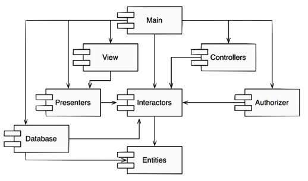
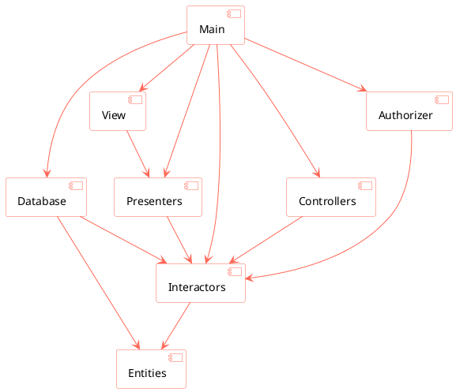

# Principios de Diseño Arquitectónico


## Granularidad

- Las aplicaciones crecen en tamaño y complejidad
- Se requiere algún tipo de organización
- La _clase_ es de un grano demasiado fino como unidad de organización

- En UML, Java y otros lenguajes se da el concepto de __paquete__ (*package*)
- En general puede hablarse de "agrupaciones lógicas de declaraciones que pueden importarse en otros programas" (__componentes__)

### Preguntas

- ¿Mejor criterio de partición?
- ¿Qué relaciones hay entre paquetes y qué principios de diseño gobiernan su uso?
- ¿Los paquetes deben diseñarse antes que las clases, o al revés?
- ¿Cómo se representan físicamente los paquetes?
- ¿Para qué usaremos esos paquetes?

### Arquitectura software

> La arquitectura de un sistema software es la forma dada al sistema por aquellos que lo construyen. La forma es la división del sistema en componentes, la disposición de esos componentes y la manera en que se comunican entre sí.
>
> <small><cite>Bob Martin</cite></small>

La finalidad de la arquitectura es facilitar el desarrollo, despliegue, operación y mantenimiento del sistema software.

## Implicaciones de SOLID en arquitectura

### SRPen arquitectura

> A module should be responsible to one, and only one, user/stakeholder/actor.
> <cite>––Robert C. Martin (2018): [Clean Architecture: A Craftsman's Guide to Software Structure and Design](bibliografia.html#cleanarch)</cite>. 

[Bob Martin's](bibliografia.html#cleanarch) chapter 7

### OCP en arquitectura

[Bob Martin's](bibliografia.html#cleanarch) chapter 8

### LSP en arquitectura

[Bob Martin's](bibliografia.html#cleanarch) chapter 9

Al pricipio de la OO, el principio LSP nació ligado al uso de la herencia para el diseño software. Hoy día, se considera más ligado al diseño de interfaces e implementaciones:

- Una interfaz Java implementada por varias clases
- Varias clases Ruby con las mismas signaturas
- Un conjunto de servicios con la misma interfaz ReST

LSP es aplicable porque habrá usuarios que dependan de interfaces bien definidas y en la posibilidad de sustitución de sus implementaciones.

#### Ejemplo de violación arquitectónica de LSP

- Un servicio agregador de taxis (uber, cabify, etc)
- La URI con que se llama al taxi se guarda en la base de datos en formato ReST:
    `purplecab.com/driver/Bob`
- El agregador añade la información de pedido y hace PUT a la URI:
    ```text
    purplecab.com/driver/Bob
      /pickupAddress/24 Maple St.
      /pickupTime/153
      /destination/ORD
    ```
- Todos los taxis de diferentes compañías deben cumplir la misma interfaz ReST.
- La compañía ACME abrevia el destino con `dest`
- Ahora la petición hay que construirla siguiendo una reglas distintas para cada conductor:
    `if (driver.getDispatchUri().startsWith("acme.com")) ...`
- Pero meter "acme.com" en el código puede ser origen de fallos y brechas de seguridad. El arquitecto define entonces un módulo adicional que decide el formato en función de la URI:

 URI   |  Dispatch format
:-------------------------:|:-------------------------:
`acme.com` | `pickupAddress/%s/pickupTime/%s/dest/%s`
`*.*`      | `pickupAddress/%s/pickupTime/%s/destination/%s`

La LSP debería extenderse hasta el nivel arquitectónico. Una violación de la posibilidad de sustitución puede contaminar la arquitectura de un sistema con mecanismos extra.

### ISP en arquitectura

[Bob Martin's](bibliografia.html#cleanarch) chapter 10

ISP = es pernicioso depender de módulos que contienen más de lo que se necesita. Esto es cierto también a nivel arquitectónico

Supongamos que un sistema $S$ quiere incluir un framework $F$ y que los creadores de $F$ lo han acoplado a una base de datos $D$:

$S \rightarrow F \rightarrow D$

Si $D$ contiene características que $F$ no usa y que a $S$ tampoco le interesan;

- los cambios en esas características de $D$ forzarán un redespliegue de $F$ y de $S$;
- los fallos en $D$ causarán fallos en $F$ y $S$.

Depender de algo que trae "equipaje" que no se necesita puede ser origen de problemas.

### DIP en arquitectura

[Bob Martin's](bibliografia.html#cleanarch) chapter 11


## Principios de Cohesión

**REP** = _Reuse/Release Equivalente Principle_
**CCP**= _Common Closure Principle_
**CRP**= _Common Reuse Principle_

### Principio REP: Equivalencia de Reutilización/Entrega


> _The granule of reuse is the granule of release.
Only components that are released through a tracking system can be effectively reused._
>
> <small><cite>Robert C. Martin</cite></small>

$\implies$ Las clases y módulos de un componente deben formar un grupo cohesionado

¿Se reutiliza código cuando se hace copia-pega? ¡No!

- Se reutiliza código si y sólo si no hace falta mirar el código fuente más allá de la parte pública del componente/biblioteca (ficheros de cabecera, etc.)
- Hay muchas herramientas de gestión de módulos y paquetes (v.g. Maven, Apache Ivy, RubyGems, etc.) que permiten reutilizar **componentes** y **bibliotecas** creadas por otros
- El código a reutilizar se debe tratar como un __producto__ en sí mismo, que no es mantenido ni distribuido por el consumidor o cliente, sino por el autor (o alguien delegado) responsable.

$\implies$ El autor debe **distribuir/hacer entregas** regulares de distintas **versiones** del componente/biblioteca.

- No se puede reutilizar algo que no haya sido liberado/entregado.
- Un cliente de una biblioteca liberada lo es __de toda la biblioteca__, no de parte de ella.
- El **grano de reutilización** no puede ser menor que el **grano de entrega**

### Principio CCP: Clausura Común

> Reunir en componentes aquellas clases que cambian por los mismos motivos y al mismo tiempo.
> Separar en componentes distintos aquellas clases que cambian en momentos distintos y por motivos diferentes.
>
> <small><cite>Robert C. Martin</cite></small>

> _The classes in a package should be closed together against the same kinds of changes. A change that affects a package affects all the classes in that package._
>
> <small><cite>Robert C. Martin</cite></small>

La __mantenibilidad__ suele ser más importante que la __reusabilidad__

- Si hay que cambiar el código, ¿dónde es mejor que estén los cambios? ¿en un mismo componente, o repartidos por varios componentes?

CCP es un intento de tener junto todo lo que es probable que cambie por una misma razón

- Es el SRP de los componentes
- CCP está conectado con OCP

Como no es posible garantizar al 100% el _cierre_ de OCP... el _cierre_ debe ser estratégico $\implies$ diseñar los sistemas para que estén **cerrados** a los **cambios más probables** que podamos anticipar.

- CCP amplía la estrategia de cierre, juntando en un mismo componente todas las clases **cerradas** para un mismo tipo de cambios.

### Principio CRP: Reutilización en Común

> No obligar a los usuarios de un componente a depender de cosas que no necesitan
> 
> <small><cite>Robert C. Martin</cite></small>

> _The classes in a package are reused together. If you reuse one of the classes in a package, you reuse them all._
> 
> <small><cite>Robert C. Martin</cite></small>

¿Qué clases ubicar en cada paquete?

- Las clases casi no se usan por separado, sino como parte de una __abstracción reutilizable__ (de colaboración entre clases)
- La abstracción donde ubicar dichas clases debe ser un mismo componente

Ejemplo: contenedor + iteradores

Cuando alguien decide usar un paquete, se crea una dependencia __sobre todo el paquete__.

- No es bueno tener que revalidar una aplicación porque hay que liberar o entregar una versión del paquete provocada por cambios hechos en clases que no importaban.
- CRP dice más sobre qué clases _no deben_ ir juntas que sobre las que _deben_ ir juntas.

CRP es la versión genérica del ISP:

- ISP aconseja no depender de clases con métodos que no usamos
- CRP aconseja no depender de componentes con clases que no usamos

### Tensión entre principios de cohesión de componentes

- REP y CCP son _inclusivos_: incrementan el tamaño de los componentes
- CRP es _exclusivo_: reduce el tamaño de los componentes


Cada arco describe el coste de abandonar el principio del vértice opuesto:

- ¿Hay demasiados componentes cambiando al mismo tiempo? $\implies$ consolidar mejor las clases (CCP)
- ¿Hay demasiadas versiones/entregas? $\implies$ minimizar las dependencias (CRP)
- ¿Es difícil reutilizar el código? $\implies$ mejorar los artefactos que se liberan (REP)

La postura en el _triángulo de tensiones_ debe ser coyuntural, pues las preocupaciones del equipo de desarrollo pueden cambiar con el tiempo.

- CCP es más importante que REP al principio de un desarrollo (cuando liberar es más importante que reutilizar) - YAGNI

## Principios de Acoplamiento

__ADPP: *Acyclic Dependencies Principle*__

### Principio de Dependencias Acíclicas

> _There must be no cycles in the coimponent dependency graph_
>
> <small><cite>Robert C. Martin</cite></small>

El grafo de dependencias entre components debe ser un DAG (_Directed Acyclic Graph_)

Hay que particionar el entorno de desarrollo en componentes "liberables" por separado.

Varios equipos de trabajo distribuidos pueden hacer cambios a cada componente por separado, lo que puede inducir nuevas dependencias entre componentes.

$\implies$ Hay que __gestionar__ la estructura de dependencias de los paquetes

#### Ejemplo: estructura de un sistema

##### Diagrama sin ciclos



- La estructura es un DAG:



- ¿A quién afecta la liberación de una nueva versión de `Presenters` por sus responsables? \
    Solo `Main`y `View` se ven afectadas

- ¿A quiénes afecta la ejecución de un test en `Presenters`? \
    `Interactors` y `Entities` (deberían ser _mocked_)

- ¿En qué orden se libera una nueva versión del sistema? \
    `Entities`, `Database` & `Interactors`, `Presenters`, `View` & `Controllers` & `Authorizer`

##### Diagrama con ciclos

- Un cambio de requisitos fuerza a introducir una nueva dependencia \
    `Entities` $\rightarrow$ `Authorizer` \
(por ejemplo, la clase `Entities::User` usa la clase `Autohizer::Permissions`)


Problemas:

- Los desarrolladores de `Database` saben que para liberarla, deben hacerla compatible con `Entities`
- `Database` debe ser ahora compatible también con `Authorizer`
- Pero `Authorizer` depende de `Interactors`

:one: $\implies$ ahora `Database` es mucho más difícil de **liberar**, porque:

- `Entities` + `Authorizer` + `Interactors` se convierten en un solo componente
- Los cambios que haga cualquier responsable de alguno de estos tres componentes afectarán al resto

:two: $\implies$ el desarrollo de **pruebas** es más difícil:

- si se quiere probar `Entities`, antes hay que construir e integrar `Authorizer` y `Interactors` (más _mocks_!)

##### Ruptura de ciclos

Dos posibles mecanismos:

1. Aplicar el principio DIP
    - Crear una interfaz con los métodos que necesita la clase `User`
    - Incluir la interfaz en `Entities`
    - Heredar de la interfaz desde `Authorizer`


2. Crear un componente nuevo (`Permissions`) del que dependan ambos (`Authorizer` y `Entities`)


La segunda alternativa puede provocar _jitters_ (lo que hacen los _gremlins_) en presencia de requisitos cambiantes: la estructura de dependencia _jitters and grows_

## Información adicional

Leer más sobre [continuous delivery](https://en.wikipedia.org/wiki/Continuous_delivery) y herramientas de [continuous integration](https://en.wikipedia.org/wiki/Continuous_integration):

- Ejemplo: [Jenkins](https://jenkins.io/), etc.