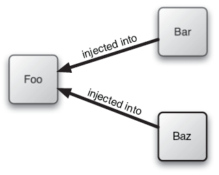
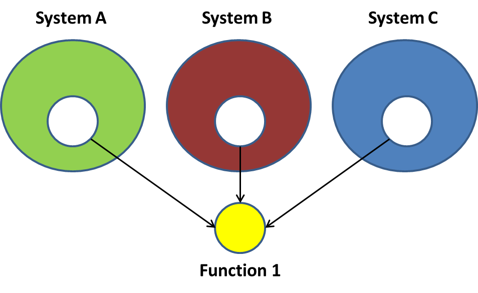

# Diseño de Sistemas Software

## Problemáticas
 - Variabilidad
 - Acoplamiento
 - Complejidad
 - Robustez
 - <span style="color:blue;">Reutilización</span>
 - <span style="color:blue;">Flexibilidad</span>

## Principios
 - Ocultación: OCP, ISP, LSP
 - Cohesión: SRP
 - Ortogonalidad: ISP
 - Delegación

## Técnicas

 - Refactoring
 - Bibliotecas y frameworks
 - Contratos
 - Inyección de dependencias
 - 

## Paradigmas
 - <span style="color:blue;">Objetos</span>
 - Eventos
 - Funcional
 - <span style="color:blue;">Aspectos</span>
 - Etc

## Casos prácticos

1. [Identificadores](#handler)
2. [Framework de pruebas unitarias](#junit)
3. [Caballeros de la mesa redonda](#knights)
4. [Guitarras Paco](#guitarras)
5. [Figuras geométricas](#figuras)


# Caso práctico 1
<a id="handler"></a>
## Identificadores 

### Versión inicial: Identificadores v0.1

```java
  class Empleado {
    private int dni;
    Empleado (String dni) throws NumberFormatException {
      this.dni = new Integer(dni).intValue();
    }
    int getDni() {
      return dni;
    }
    public String toString() {
      return new Integer(dni).toString();
    }
    public int compareTo(Empleado otro) {
       return this.dni - otro.getDni();
    }
    public boolean equals(Empleado otro) {
       return dni==otro.getDni();
    }
  }
```      

####Críticas:

- __Flexibilidad__: El Real Decreto 338/1990 regula el uso de NIFs en lugar de DNIs. ¡Hay que cambiar toda la implementación!


### Implementación alternativa: Identificadores v0.2

```java
  class Empleado {
    private String nif;
    Empleado (String nif) {
      this.nif = nif
    }
    int getNif() { return id; }
    public String toString() { return nif; }
    public int compareTo(Empleado otro) {
       return nif.compareTo(otro.getNif());
    }
    public boolean equals(Empleado otro) {
       return nif.equals(otro.getId());
    }
  }
```      

####Críticas:

- __Reutilización__: Posiblemente haya más situaciones (algunas futuras) donde hagan falta _identificadores_ que incluso pueden cambiar. Por ejemplo: números de la seguridad social, tarjetas de identidad, números de cuenta corriente, IBAN, etc.

### Hacemos refactoring: patrón *handler*

-   Manejo de *identificadores* de forma independiente de la
    implementación del objeto identificado.

-   Cambio fácil de implementación de los identificadores (`int`,
    `String`, etc.) hacia cualquier tipo básico o clase primitiva,
    sencilla o compuesta.


## Patrón Handler


- __Identifiable__: Clase cliente que necesita identificar a sus objetos a 
  través de algún atributo identificador

- __Handler__: Interfaz para declarar los identificadores de los objetos de
   la clase `Identifiable`

- __ConcreteHandler__: Implementación concreta de la interfaz `Handler`


### Implementación del patrón

```java
  interface Handler{
      String toString();
      int compareTo(Handler otro);
  }
  class IdentificadorNumerico implements Handler {
    private int id;
    IdentificadorNumerico (String id) throws NumberFormatException {
      this.id = new Integer(id).intValue();
    }
    public String toString() {
      return new Integer(id).toString();
    }
    public int compareTo(Handler otro) {
      return toString().compareTo(otro.toString());
    }
  }
```


## Ejercicio: `java.lang.Comparable`

Implementar un identificador utilizando `java.lang.Comparable` del JDK.

`Comparable` es una interfaz implementada por `String`, `File`, `Date`, etc. y todas las llamadas _clases de envoltura_ del JDK (i.e. `Integer`, `Long`, etc.)

__Métodos de la interfaz__:

```java
  public int compareTo(Object o) throws ClassCastException
```

__Invariantes:__

`sgn(x.compareTo(y)) = -sgn(y.compareTo(x))`

`(x.compareTo(y)>0 and y.compareTo(z)>0)` $$\Rightarrow$$
`x.compareTo(z)>0`

`x.compareTo(y)=0` $$\Rightarrow$$
`sgn(x.compareTo(z))=sgn(y.compareTo(z))` $$\forall$$ `z`

__Consistencia con `equals`__:

`(x.compareTo(y)=0)`
$$\Leftrightarrow$$ `(x.equals(y))`


##Reutilización y flexibilidad

-  __Flexibilidad__: Adaptarse a cambios de requisitos y construir 
       software fácil de cambiar
-  __Reutilización__: Construir software fácil de reutilizar sin
       tener que cambiar los módulos ya escritos


# Caso práctico 2
<a id="junit"></a>
## Framework de pruebas unitarias

-   JUnit es un framework en Java que sirve para diseñar, construir y
    ejecutar **pruebas unitarias**
-   Una prueba unitaria comprueba la corrección de un
    _módulo_ de software en cuanto a funcionalidades
    que ofrece.
-   En el caso de Java, las pruebas unitarias comprueban la corrección
    de cada uno de los métodos de _cada clase_.
-   ¿Cómo funciona?


### ¿Cómo probar `Saludo.java`?

Incluir un método `main` que pruebe la funcionalidad de la clase:

```java
class Saludo {
	/**
	* Imprime "Hola Mundo!"
	*/
	void saludar() {
		System.out.println("Hola Mundo!");
	}
	/**
	* Imprime un mensaje
	*/
	void saludar(String mensaje) {
		System.out.println(mensaje);
	}
	
	/**
	* Tests
	*/
	public static void main( String[] args ) {
		Saludo saludo1 = new Saludo();
		saludo1.saludar();
		
		Saludo saludo2 = new Saludo("Hola caracola!");
		saludo2.saludar();
	}
}
```

### Pegas

-   Cuanto más grande sea la interfaz de la clase, mayor será el main

-   El tamaño del código de la clase crece por las pruebas

-   Poco fiable, porque main forma parte de la misma clase y tiene
    acceso a los elementos privados

-   Difícil de automatizar las pruebas, incluso pasando argumentos a
    main

### Ejemplo: software _cliente_ del framework

#### Caso de prueba con jUnit 4

```java
  import org.junit.*;
  import static org.junit.Assert.*;

  public class SaludoTest {
    public static void main(String args[]) {
      junit.textui.TestRunner.run(SaludoTest.class);
    }
    @Test
    public void saludar() {
      Saludo hola = new Saludo();
      assert( hola!=null );
      assertEquals("Hola Mundo!", hola.saludar() );
    }
  }
```

Ejecución de los tests:

```java
import org.junit.runner.JUnitCore;
import org.junit.runner.Result;
import org.junit.runner.notification.Failure;

public class MyTestRunner {
  public static void main(String[] args) {
    Result result = JUnitCore.runClasses(SaludoTest.class);
    for (Failure failure : result.getFailures()) {
      System.out.println(failure.toString());
    }
  }
}
```

¿De qué están hechas las anotaciones como `@Test`?
Veamos una versión anterior de jUnit, que expone más claramente las _tripas_ del framework

#### Caso de prueba con jUnit 3

```java
import junit.framework.TestCase;
import junit.framework.Assert;
  
public class SaludoTest extends TestCase {
    public SaludoTest(String nombre) {
      super(nombre);
    }
    public void testSaludar() {
      Saludo hola = new Saludo();
      assert( hola!=null );
      assertEquals("Hola Mundo!", hola.saludar() );
    }
}
```


### Diseño del framework jUnit

####Estructura de clases:


####Ejecución de casos de prueba:


### Ejemplo: aplicación de comercio electrónico

Diseño de una aplicación de comercio electrónico:

  - `ShoppingCart` - carrito de la compra
  - `CreditCard` - tarjeta de crédito
  - `Product`- artículos
  - Etc.

Diseño de pruebas unitarias de `ShoppingCart` para:

  -   Probar carrito de la compra (añadir/eliminar artículos)
  -   Probar validación de tarjetas de crédito
  -   Probar manejo de varias monedas
  -   Etc.

#### ShoppingCart

```java
public class ShoppingCart {
  private ArrayList items;
  public ShoppingCart() { ... }
  public double getBalance() { ... }
  public void addItem(Product p) { ... }
  public void removeItem(Product p)
      throws ProductNotFoundException { ... }
  public int getItemCount() { ... }
  public void empty() { ... }
  public boolean isEmpty() { ... }
}
```      

#### ShoppingCartTestCase con jUnit 3

```java
import junit.framework.TestCase;
import junit.framework.TestSuite;
import junit.framework.Assert;

public class ShoppingCartTest extends TestCase {
  private ShoppingCart bookCart;
  private Product defaultBook;
  //...
  protected void setUp() {
      bookCart = new ShoppingCart();
      defaultBook = new Product("Extreme Programming", 23.95);
      bookCart.addItem(defaultBook);
  }
  protected void tearDown() {
      bookCart = null;
  }  
  public void testEmpty() {
      bookCart.empty();
      assertTrue(bookCart.isEmpty());
  }
  public void testProductAdd() {
      Product book = new Product("Refactoring", 53.95);
      bookCart.addItem(book);
      double expectedBalance = defaultBook.getPrice() + book.getPrice();
      assertEquals(expectedBalance, bookCart.getBalance(), 0.0);
      assertEquals(2, bookCart.getItemCount());
  }
  public void testProductRemove() throws ProductNotFoundException {
      bookCart.removeItem(defaultBook);
      assertEquals(0, bookCart.getItemCount());
      assertEquals(0.0, bookCart.getBalance(), 0.0);
  }
  public void testProductNotFound() {
      try {
          Product book = new Product("Ender's Game", 4.95);
          bookCart.removeItem(book);
          fail("Should raise a ProductNotFoundException");
      } catch(ProductNotFoundException success) {
          ...
      }
  }
  public static Test suite() {
      // Use reflection to add all testXXX() methods
         TestSuite suite = new TestSuite(ShoppingCartTest.class);
      // Alternatively, but prone to error when adding more
      // test case methods...
      // TestSuite suite = new TestSuite();
      // suite.addTest(new ShoppingCartTest("testProductAdd"));
      // suite.addTest(new ShoppingCartTest("testEmpty"));
      // suite.addTest(new ShoppingCartTest("testProductRemove"));
      // suite.addTest(new ShoppingCartTestCase("testProductNotFound"));
         return suite;
  }
}
```      

Ahora agrupamos varios casos de prueba en una misma _suite_:

```java
import org.junit.runner.JUnitCore;
import org.junit.runner.Result;
import org.junit.runner.notification.Failure;

public class MyTestRunner {
  public static void main(String[] args) {
    Result result = JUnitCore.runClasses(EcommerceTestSuite.class);
    for (Failure failure : result.getFailures()) {
      System.out.println(failure.toString());
    }
  }
}
```

#### ShoppingCartTestCase con jUnit 4

```java
import static org.junit.Assert.assertEquals;
import static org.junit.Assert.fail;

import org.junit.After;
import org.junit.Before;
import org.junit.Test;

public class ShoppingCartTest {
  private ShoppingCart bookCart;
  private Product defaultBook;
  //...
  @Before
  protected void setUp() {
      bookCart = new ShoppingCart();
      defaultBook = new Product("Extreme Programming", 23.95);
      bookCart.addItem(defaultBook);
  }
  @After
  protected void tearDown() {
      bookCart = null;
  }
  @Test
  public void testEmpty() {
      bookCart.empty();
      assertTrue(bookCart.isEmpty());
  }
  @Test
  public void testProductAdd() {
      Product book = new Product("Refactoring", 53.95);
      bookCart.addItem(book);
      double expectedBalance = defaultBook.getPrice() + book.getPrice();
      assertEquals(expectedBalance, bookCart.getBalance(), 0.0);
      assertEquals(2, bookCart.getItemCount());
  }
  @Test
  public void testProductRemove() {
      bookCart.removeItem(defaultBook);
      assertEquals(0, bookCart.getItemCount());
      assertEquals(0.0, bookCart.getBalance(), 0.0);
  }
  @Test(expected = ProductNotFoundException.class)
  public void testProductNotFound() {
      Product book = new Product("Ender's Game", 4.95);
      bookCart.removeItem(book);
      fail("Should raise a ProductNotFoundException");
  }
}
```  

#### EcommerceTestSuite con jUnit 3

```java
  public class EcommerceTestSuite extends TestSuite {
      //...
      public static Test suite() {
          TestSuite suite = new TestSuite();
          suite.addTest(ShoppingCartTest.suite());
          suite.addTest(CreditCardTest.suite());
          // etc.
          return suite;
      }
  }
```      

#### EcommerceTestSuite con jUnit 4

```java
  @RunWith(Suite.class)
  @SuiteClasses({ ShoppingCartTest.class,
                  CreditCardTest.class })
  public class EcommerceTestSuite {
      //...
  }
```    


### Arquitectura del framework


En la arquitectura del framework se observan diversos patrones: Composite, Command, Adapter, Factory, Decorator, etc.

  

## Bibliotecas y frameworks

### Biblioteca


### Frameworks

#### Definición de *framework*

> Colección de clases e interfaces que cooperan para formar un diseño reutilizable de un tipo específico de software
> 
> -- <cite>[E. Gamma et al.](#gamma)</cite>

-   El framework proporciona unas guías arquitectónicas (diseño empaquetado) para dividir el diseño en clases abstractas y definir sus _responsabilidades_ y _colaboraciones_.
-   El framework se debe personalizar definiendo subclases y combinando
    instancias, o bien configurando valores que definen el comportamiento por defecto


#### Principios de diseño

-   Datos encapsulados
-   Interfaces y clases abstractas
-   Métodos polimórficos
-   Delegación

#### Herramientas de diseño

-   __Patrones__: elementos reutilizables de diseño 
-   __Frameworks__: colecciones de patrones abstractos a aplicar


#### Framework vs. biblioteca

-   API orientado a objetos
-   Flujo de control invertido
-   Programador cliente (código específico) vs. de programador de bibliotecas (código reutilizable)

#### Flujo de control en un framework


### Principios y técnicas de un framework

-   Abstracción
    -  Clases y componentes abstractos
    -  Interfaces abiertas
    -  Uso de patrones de diseño
    -  Componentes de un dominio específico

-   Máxima cohesión, mínimo acoplamiento
    -  Minimizar dependencias: Una clase presenta una dependencia con otra clase si la primera usa una instancia de la segunda.
    -  Cuando no se pueden eliminar las dependencias, mantener las abstractas e _inyectar_ las concretas.
    -  **Inyección de dependencias**: una clase o módulo no debería configurar sus dependencias estáticamente, sino ser configurada desde fuera


# Caso práctico 3
<a id="knights"></a>
## Ejemplo: Caballeros de la mesa redonda
### Tomado de <a id="bibliografia#spring">Spring in Action</a>

Añadir pruebas unitarias a la solución siguiente:

```java
public class KnightOfTheRoundTable {
  private String name;
  private HolyGrailQuest quest;
  public KnightOfTheRoundTable(String name) {
    this.name = name;
    quest = new HolyGrailQuest();
  }
  public HolyGrail embarkOnQuest()
      throws GrailNotFoundException {
    return quest.embark();
  }
}
  

public class HolyGrailQuest {
  public HolyGrailQuest() {}
  public HolyGrail embark()
          throws GrailNotFoundException {
  HolyGrail grail = null;
    // Look for grail
    ...
    return grail;
  }
}  
```      

### Diseño de pruebas con jUnit 3

¿Dónde está el acoplamiento?

```java
import junit.framework.TestCase;
public class KnightOfTheRoundTableTest extends TestCase {
  public void testEmbarkOnQuest() throws GrailNotFoundException {
    KnightOfTheRoundTable knight =
        new KnightOfTheRoundTable("CruzadoMagico");
    HolyGrail grail = knight.embarkOnQuest();
    assertNotNull(grail);
    assertTrue(grail.isHoly());
  }
}
```      

-   Instanciación de `HolyGrail`

-   Cada vez que se prueba `KnightOfTheRoundTable`, también se prueba
    `HolyGrailQuest`.

-   No se puede pedir a `HolyGrailQuest` que se comporte de otra
    forma (v.g. devolver null o elevar una excepción)


Ocultar la implementación detrás de una interfaz:

```java
public interface Knight {
  Object embarkOnQuest() throws QuestFailedException;
}
    
public class KnightOfTheRoundTable implements Knight {
  private String name;
  private Quest quest;
  public KnightOfTheRoundTable(String name) {
    this.name = name;
    quest = new HolyGrailQuest();
  }
  public Object embarkOnQuest() throws QuestFailedException {
    return quest.embark();
  }
}    

public interface Quest {
  abstract Object embark()
    throws QuestFailedException;
}
    
public class HolyGrailQuest implements Quest {
  public HolyGrailQuest() {}
  public Object embark() throws QuestFailedException {
    // Do whatever it means to embark on a quest
    return new HolyGrail();
  }
}
```  

-   El `Knight` aún recibe un tipo específico de `Quest`
-   ¿Debe ser el caballero responsable de obtener un desafío?


```java
public class KnightOfTheRoundTable implements Knight {
  private String name;
  private Quest quest;
  public KnightOfTheRoundTable(String name) {
    this.name = name;
  }
  public Object embarkOnQuest() throws QuestFailedException {
    return quest.embark();
  }
  public void setQuest(Quest quest) {
    this.quest = quest;
  }
}
```  

-   El caballero sólo sabe del desafío a través de su interfaz `Quest`.

-   Puede asignársele cualquier implementación de `Quest`
    (`HolyGrailQuest`, `RescueDamselQuest`, etc.)


## Inyección de dependencias



-   Inversión de control: base de la inyección de dependencias

> The question is: "what aspect of control are they inverting?" [...] Early user interfaces were controlled by the application program. You would have a sequence of commands like "Enter name", "enter address"; your program would drive the prompts and pick up a response to each one. With graphical (or even screen based) UIs the UI framework would contain this main loop and your program instead provided event handlers for the various fields on the screen. The main control of the program was inverted, moved away from you to the framework
> 
> <cite> Martin Fowler</cite>, http://martinfowler.com/articles/injection.html  

-   Una aplicación son dos o más clases que colaboran.
-   Los objetos deben recibir las dependencias en su creación, por parte de una entidad externa que coordina los objetos.
-   Inversión de la responsabilidad de cómo un objeto obtiene
    referencias a los objetos con los que colabora
-   Ventaja = __bajo acoplamiento__: un objeto sólo sabe de sus dependencias por su
    interfaz, no por su implementación, ni por cómo fueron instanciados. Entonces la dependencia puede cambiarse por una implementación distinta (incluso en tiempo de ejecución)
- _Hollywood Principle: Don't call us, we'll call you"._


# Discusión sobre la reutilización

> We most likely would have been better off not attempting to create a reusable function in the first place 
> 
> -- <cite>Roger Sessions, The Misuse of Reuse [1]</cite>


[1] http://simplearchitectures.blogspot.com.es/2012/07/misuse-of-reuse.html


### Factorizar una función




#### Ventajas (supuestas) de reutilizar:

__Ahorro__: Si $$\exists s$$ sistemas $$\wedge ~ coste(Function~1) = c$$ €

$$\Rightarrow$$
ahorro = $$c \times (s-1)$$ €


#### Amenazas (reales):


- Realmente el ahorro depende de la __complejidad__. Y muchas veces, la complejidad de la función está exponencialmente relacionada con el número de sistemas.
- Con un único punto de fallo, Si la función 1 falla, todos los sistemas pueden fallar a la vez.
- La seguridad es inversamente proporcional a la complejidad del sistema.
- Se incrementan los costes de llevar los sistemas a la nube.

####Conclusión

No crear funciones reutilizables en primer lugar

Aplicar el principio __YAGNI__: __You Ain't Gonna Need It__


# Caso práctico 4
<a id="guitarras"></a>

## Guitarras Paco

El cliente (Paco) quiere:

-   Mantener un inventario de guitarras

-   Encontrar guitarras para sus clientes

Problemas de la aplicación heredada:

-   Caso de uso: un cliente busca una guitarra flamenca ‘Valeriano
    Bernal’, pero no encuentra ninguna

-   ¿Problemas?

### Una aplicación heredada


### Implementación: Guitarra

```java
  public class Guitar {     
     private String serialNumber, builder, model, type, backWood, topWood;
     private double price;
        
     public Guitar(String serialNumber, double price,
                        String builder, String model, String type,
                        String backWood, String topWood) {
        this.serialNumber = serialNumber;
        this.price = price;
        this.builder = builder;
        this.model = model;
        this.type = type;
        this.backWood = backWood;
        this.topWood = topWood;
     }
          
     public String getSerialNumber() {return serialNumber;}
     public double getPrice() {return price;}
     public void setPrice(float newPrice) {
        this.price = newPrice;
     }
     public String getBuilder() {return builder;}
     public String getModel() {return model;}
     public String getType() {return type;}
     public String getBackWood() {return backWood;}
     public String getTopWood() {return topWood;}
  }
```      


### Implementación: Inventario

```java
public class Inventory {
  private List guitars;
  public Inventory() { guitars = new LinkedList(); }
  public void addGuitar(String serialNumber, double price,
                        String builder, String model,
                        String type, String backWood, String topWood) {
    Guitar guitar = new Guitar(serialNumber, price, builder,
                               model, type, backWood, topWood);
    guitars.add(guitar);
  }
  public Guitar getGuitar(String serialNumber) {
    for (Iterator i = guitars.iterator(); i.hasNext(); ) {
      Guitar guitar = (Guitar)i.next();
      if (guitar.getSerialNumber().equals(serialNumber)) {
        return guitar;
      }
    }
    return null;
  }
  public Guitar search(Guitar searchGuitar) {
    for (Iterator i = guitars.iterator(); i.hasNext(); ) {
      Guitar guitar = (Guitar)i.next();
      String builder = searchGuitar.getBuilder().toLowerCase();
      if ((builder != null) && (!builder.equals("")) &&
          (!builder.equals(guitar.getBuilder().toLowerCase())))
        continue;
      String model = searchGuitar.getModel().toLowerCase();
      if ((model != null) && (!model.equals("")) &&
          (!model.equals(guitar.getModel().toLowerCase())))
        continue;
      String type = searchGuitar.getType().toLowerCase();
      if ((type != null) && (!searchGuitar.equals("")) &&
          (!type.equals(guitar.getType().toLowerCase())))
        continue;
      String backWood = searchGuitar.getBackWood().toLowerCase();
      if ((backWood != null) && (!backWood.equals("")) &&
          (!backWood.equals(guitar.getBackWood().toLowerCase())))
        continue;
      String topWood = searchGuitar.getTopWood().toLowerCase();
      if ((topWood != null) && (!topWood.equals("")) &&
          (!topWood.equals(guitar.getTopWood().toLowerCase())))
        continue;
      return guitar;
    }
    return null;
  }
}
```      

## Algunos problemas

-   Se compara el fabricante sin tener en cuenta mayúsculas/minúsculas

-   Se comparan todos los campos sin tener en cuenta
    mayúsculas/minúsculas

-   No hay definidas constantes para cada fabricante

¿Estas soluciones abordan el verdadero problema?

Preguntar a Paco...


### Preguntar al cliente

Preguntemos a Paco, que no tiene por qué saber nada de objetos ni bases
de datos:

-   ¿Sólo vendes guitarras?

-   ¿Cómo actualizas el inventario?

-   ¿Cómo funciona la búsqueda de guitarras?

-   ¿Necesitarás informes de inventario y de ventas?

### Respuestas del cliente

Paco dice que:

-   Los clientes no siempre conocen las características exactas de la
    guitarra que quieren

-   Los clientes suelen buscar guitarras dentro de un rango de precios

-   Suele haber más de una guitarra que casa con las necesidades del
    cliente

-   Sí, necesito informes y demás, pero ¡la prioridad nº 1 es encontrar
    las guitarras!

## Ejercicio

Hacer refactoring de la aplicación heredada de Guitarras Paco


# Caso práctico 5:
<a id="figuras"></a>
## Figuras geométricas


[Uncle Bob Martin principles](http://butunclebob.com/ArticleS.UncleBob.PrinciplesOfOod)

## Principio de responsabilidad única 

__SRP: *Single responsibility Principle*__

> A class should have onlye one reason to change
> <cite>Uncle Bob Martin, </cite>

-   Una clase que modela intereses múltiples genera acoplamiento entre
    los intereses
-   Un cambio en algún interés obligará a cambios accidentales en los
    clientes que no dependen de dicho interés
    
<!-- -   Los módulos enmarañados que nunca cambian no son problemáticos-->

SRP es lo mismo que el principio de __cohesión__ de [DeMarco](#demarco)


###Ejemplo: Shapes v1 en Java

¿Qué parte no cumple SRP en el ejemplo de las figuras? 

¿Cuántas responsabilidades tienen las clases que implementan la interfaz `Shape`? ¿Cuáles son?
 
```java
package shapes;
interface Shape {
  double area();
  void draw();
}

class Point {
  double getX() {...}
  double getY() {...}
}

abstract class Polygon implements Shape {
  Point getVertex(index i) {...}
  void draw() {...}
  String toString() {...}
}

class Triangle extends Polygon {
  double area() {...}
}

abstract class RectParallelogram extends Polygon {
  double area() {...}
}

class Square extends RectParallelogram {...}

class Rectangle extends RectParallelogram {...}

abstract class ClosedCurve implements Shape {...}

class Circle
    extends ClosedCurve {
  double getRadius() {...}
  Point getCenter() {...}
  double area() {...}
  void draw() {...}
  String toString() {...}
}

class Ellipse extends ClosedCurve {
  double getApogeeRadius() {...}
  double getPerigeeRadius() {...}
  Point getFocus1() {...}
  Point getFocus2() {...}
  Point getCenter() {...}
  double area() {...}
  void draw() {...}
  String toString() {...}
}
```

- Dos responsabilidades: geometría computacional + dibujo en pantalla
- Todas las figuras tienen métodos `draw` y `toString` (dibujar en pantalla) además del método `area` que calcula el área (geometría computacional) $$\rightarrow$$ Violación del SRP

####Solución:

Patrones de diseño: _visitor_

####Otros ejemplos

- ActiveRecord viola SRP. Sustituir por DAO
- 
     
## Principio de Abierto-Cerrado

__OCP: *Open-Closed Principle*__

> Toda clase, módulo, aspecto o función debe quedar abierto para extensiones pero cerrado para modificaciones
> 
> <cite>B. Meyer, [Object Oriented Software Construction](#meyer)</cite>


-   Si un cambio en un sitio origina una cascada de cambios en otros
    puntos del sistema, el resultado es un sistema frágil y rígido

-   Es difícil averiguar todos los puntos que requieren cambios

-   Código cerrado para modificaciones, pero abierto para extensión
    mediante delegación en vertical (subclases) u horizontal (composición)

¿Qué parte no cumple OCP en el ejemplo? 

### Ejemplo: versión 2 en C++

```c++
enum ShapeType {circle, square};

struct Shape
{
  ShapeType itsType;
};

struct Circle
{
  ShapeType itsType;
  double itsRadius;
  Point itsCenter;
};

struct Square
{
  ShapeType itsType;
  double itsSide;
  Point itsTopLeft;
};

void DrawSquare(struct Square*)
void DrawCircle(struct Circle*);
typedef struct Shape *ShapePointer;

void DrawAllShapes
   (ShapePointer list[], int n)
{
  int i;
  for (i=0; i<n; i++)
  {
    struct Shape* s = list[i];
    switch (s->itsType)
    {
      case square:
        DrawSquare((struct Square*)s);
        break;
      case circle:
        DrawCircle((struct Circle*)s);
        break;
    }
  }
}
```

- `DrawAllShapes` no está cerrado para modificaciones cuando aparecen nuevos tipos de `Shape`

####Solución

- Abstracción (Ocultación de la implementación): clase abstracta y métodos polimórfico: patrones de diseño _template method_ y/o _strategy_

Aplicando el OCP...

```c++
class Shape {
  public:
    virtual void Draw() const = 0;
};
class Square : public Shape {
  public:
    virtual void Draw() const;
};
class Circle : public Shape {
  public:
    virtual void Draw() const;
};
void DrawAllShapes(Set<Shape*>& list) {
  for (Iterator<Shape*>i(list); i; i++)
    (*i)->Draw();
}
```         

- Si queremos ampliar el comportamiento de `DrawAllShapes`, solo tenemos que añadir una nueva clase derivada de `Shape`
- Si se aplica bien OCP, los cambios de un cierto tipo obligan a añadir nuevo código, no a modificar el existente
 
>  model is not natural in a system in which ordering is coupled to shape type. This leads us to a disturbing conclusion. In general, no matter how "closed" a module is, there will always be some kind of change against which it is not closed. There is no model that is natural to all contexts!
> Since closure cannot be complete, it must be strategic. That is, the designer must choose the kinds of changes against which to close the design, must guess at the kinds of changes that are most likely, and then construct abstractions to protect against those changes.
> 
> Bob C. Martin