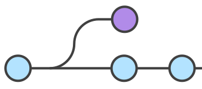

# Sistema de Control de Versiones (SCV)


<style>
emph {
  color: #E87B00;
}
</style>

## SCV

### ¿Qué es un Sistema de Control de Versiones (SCV)?

Un SCV, en inglés *Version Control System* (VCS), registra los cambios realizados en un conjunto de archivos a lo largo del tiempo.

Permite recuperar versiones específicas de esos archivos, útil para el trabajo colaborativo y para mantener un historial de cambios.

### Repositorio

Lugar donde se almacenan los archivos de un proyecto, junto con el historial de cambios.

Puede estar ubicado localmente en la máquina del usuario o de forma remota en un servidor.

## SCV: Source Code Versioning


<emph>VCS: Version Control Systems</emph> &nbsp; &nbsp; &nbsp; &nbsp; &nbsp; &nbsp; <emph>SCM: Source Code Management</emph>

¿Para qué sirven?

- Rastrear cambios y restaurar versiones anteriores del software
- Gestionar y coordinar el código fuente en equipos de desarrollo de software
- Seguimiento de varias líneas de trabajo y ayudar a fusionar líneas

El código fuente es un activo vital para cualquier equipo de desarrollo de software. Las herramientas de gestión de código fuente sirven para rastrear cambios, lo que facilita la recreación de versiones anteriores del software y ver cómo se desarrolla con el tiempo.

También sirven para coordinar a un equipo de programadores que trabajan en un código base común. Al registrar los cambios que cada desarrollador realiza, estos sistemas pueden hacer un seguimiento de múltiples líneas de trabajo al mismo tiempo y ayudar a los desarrolladores a fusionar estas líneas de trabajo.

## Herramientas SCV

- <emph>Subversion (SVN)</emph>: sistema **centralizado** de control de versiones
  - Un solo repositorio central que almacena todas las versiones
  - Los usuarios deben estar conectados al repositorio central para trabajar

- <emph>Git</emph>: sistema **distribuido** de control de versiones
  - Cada usuario tiene una copia completa del repositorio
  - Los usuarios pueden trabajar de forma independiente sin necesidad de una conexión constante a un servidor central

Git fue creado por Linus Torvalds en 2005 y se ha convertido en uno de los SCV más populares y ampliamente utilizados en la comunidad de desarrollo de software.

## Plataformas en la nube


Alojamiento de repositorios (y más cosas) en la nube como GitHub, GitLab y Bitbucket.

Permiten a los desarrolladores alojar y colaborar en proyectos de código abierto y repositorios públicos o privados de forma remota.

## GitHub


- Forja donde alojar proyectos software
- Origen en 2008 y adquirido por Microsoft en 2019
- Basado en el SCV distribuido `git`

### Servicios de GitHub

- Code hosting
- Version control
- Releases
- Issues, labels & milestones
- Actions & workflows
- Etc.

## Instalación de Git

### Linux

```bash
sudo apt update
sudo apt install git
```

### Windows

Descarga e instala Git desde el sitio web oficial [Git Download](https://git-scm.com/downloads)

### Mac

Descarga e instala Git desde el sitio web oficial [Git for Mac](https://git-scm.com/download/mac) o usando brew:

```bash
brew install git
```

## Trabajando con repositorios

### Inicializar un repositorio local

En caso de que no exista un repositorio local, podemos crear uno con:

```bash
git init
```

- Se creará un nuevo repositorio de Git en ese directorio
- Se crea un directorio oculto llamado `.git` que contiene todos los archivos necesarios para el repositorio

Sin embargo, en la mayoría de los casos, clonaremos un repositorio remoto.

### Clonar un repositorio remoto

Al clonar un repositorio remoto, se crea una copia del repositorio en nuestro equipo que debemos sincronizar manualmente.

```bash
git clone <repo>
```

Los repositorios tendrán sus propios permisos de lectura y escritura.

Si son privados, necesitareis autenticaros para poder clonarlos.

Vamos a usar un repositorio público de Github:
  
```bash
  git clone https://github.com/sistemas-sw/iiss-git-<curso_actual>.git
```

Donde `<curso_actual>` es el curso actual (por ejemplo, `24-25`).

### Actualizar un repositorio local

Creamos un archivo de texto usando nuestro identificador UCA como nombre `uxxxxxxxx.txt`.

Para agregar el archivo al repositorio local, usamos el comando `git add`:

```bash
git add <file>
```

Podemos añadir todos los archivos y directorios nuevos o modificados con:

```bash
git add .
```

Podemos comprobar el estado del repositorio local usando el comando `git status`:

- Archivos nuevos o modificados aparecerán en rojo
- Archivos añadidos al repositorio aparecerán en verde

### Actualizar cambios

Para confirmar los cambios en el repositorio local, usamos el comando `git commit`:

```bash
git commit -m "Mensaje"
```

- El mensaje debe ser descriptivo y debe indicar los cambios realizados
- Al ejecutar `git commit`, se crea un nuevo commit en el repositorio local
- Cada commit tiene un identificador único que se puede usar para identificarlo

### Sincronizar cambios

Para subir los cambios al repositorio remoto, usamos el comando `git push` (debemos tener permisos de escritura en el repositorio remoto):

```bash
git push
```

Si queremos actualizar nuestro repositorio local con los cambios del repositorio remoto:

```bash
git pull
```

### Comprobar cambios

Para ver las diferencias entre el repositorio local y el repositorio remoto:

```bash
git diff
git diff <file>
```

Para ver el historial de cambios realizados en el repositorio local:

```bash
git log
git log <file>
```

Para ver el historial de cambios realizados en el repositorio remoto:

```bash
git log origin/main
git log origin/main <file>
```

### Deshacer cambios

Para deshacer los cambios realizados en un archivo:

```bash
git checkout <file>
```

Para deshacer los cambios realizados en todos los archivos:

```bash
git checkout .
```

Si queremos deshacer los cambios realizados en un archivo que hemos añadido al repositorio:

```bash
git reset HEAD <file>
```

HEAD hace referencia al último commit realizado.

## Trabajando con ramas

Una rama es una línea de desarrollo independiente que permite trabajar en un conjunto de cambios sin afectar al resto del proyecto.

Las ramas se pueden fusionar entre sí para combinar los cambios realizados en cada una de ellas.


[Ejemplo de ramas en un repositorio de Git](https://www.atlassian.com/git/tutorials/using-branches)

### Crear ramas

Una rama se crea a partir de otra rama existente



- `git branch` muestra las ramas existentes
- Podemos ver la rama actual con `git branch` y con `git status`.

Para crear una nueva rama a partir de la rama actual:

```bash
git branch <nombre_de_la_rama>
```

Para crear una nueva rama a partir de la rama actual y cambiar a ella:

```bash
git checkout -b <nombre_de_la_rama>
```

### Checkout y push de ramas

Cambiar de rama:

```bash
git checkout <nombre_de_la_rama>
```

Subir una rama al repositorio remoto:

```bash
git push origin <nombre_de_la_rama>
```

### Eliminar ramas

Eliminar una rama del repositorio local (seguirá existiendo en el repositorio remoto):

```bash
git branch -d <nombre_de_la_rama>
```

Eliminar una rama del repositorio remoto (seguirá existiendo en el repositorio local):

```bash
git push origin --delete <nombre_de_la_rama>
```

### Stash de ramas

Guardar/esconder los cambios realizados en la rama actual para poder cambiar de rama sin tener que hacer un commit

`git stash` - guardar los cambios realizados en la rama actual

`git stash pop` - recuperar los cambios guardados

`git stash list` - ver los cambios guardados

`git stash drop` - eliminar los cambios guardados

### Fusionar ramas

Siempre que se fusionan dos ramas, se crea en la rama actual un nuevo commit que contiene los cambios de ambas ramas:


[Ejemplo de fusión de ramas en un repositorio de Git](https://www.atlassian.com/es/git/tutorials/using-branches/git-merge)

Para fusionar una rama con la rama actual:

```bash
git merge <nombre_de_la_rama>
```

- Si no hay conflictos, se fusionarán automáticamente
- Si hay conflictos, se mostrará un mensaje de error y habrá que resolverlos manualmente

Para resolver conflictos, se editan los archivos que los contienen y se añaden al repositorio con `git add`.

Una vez resueltos los conflictos, se puede fusionar la rama con la rama actual.

### Ejemplo de conflicto entre ramas

1. Crear una rama nueva llamada `prueba1` a partir de la rama actual y cambiar a ella
2. Editar el archivo `uxxxxxxxx.txt` y añadir una línea con el texto `prueba1`
3. Añadir el archivo al repositorio local y hacer un commit
4. Cambiar a la rama `main`
5. Editar el archivo `uxxxxxxxx.txt` y añadir una línea con el texto `main`
6. Añadir el archivo al repositorio local y hacer un commit
7. Fusionar la rama `prueba1` con la rama `main`


### Solucionar conflictos entre ramas

Podemos ver los conflictos con `git status`.

Para solucionar el conflicto, editamos el archivo `uxxxxxxxx.txt` y dejamos el contenido que queramos.

También podemos solucionar el conflicto aceptando el contenido de una de las ramas con:

```bash
git checkout --ours <file>
```

```bash
git checkout --theirs <file>
```

Donde `ours` es la rama actual y `theirs` es la rama que estamos fusionando.

### Rebase de ramas

Rebase soluciona el mismo problema que la fusión de ramas, pero de forma muy distinta:

- `merge` crea un nuevo commit que contiene los cambios de ambas ramas
- `rebase` mueve los commits de una rama a otra


[Ejemplo de rebase de ramas en un repositorio de Git](https://www.atlassian.com/es/git/tutorials/merging-vs-rebasing)

Para hacer un rebase de una rama con la rama actual:

```bash
git rebase <nombre_de_la_rama>
```

1. Crear una rama llamada `feature_rebase` a partir de la rama actual y cambiar a ella
2. Crea un archivo `feature_rebase.txt`
3. Añadir el archivo al repositorio local y hacer un commit
4. Cambiar a la rama `main`
5. Añadir un archivo `main.txt`
6. Añadir el archivo al repositorio local y hacer un commit
7. Cambiar a la rama `feature_rebase`
8. Hacer un rebase de la rama `feature_rebase` con la rama `main`
9. Comprobar el historial de cambios con `git log`

- Rebase actualiza el historial de cambios de una rama con el historial de cambios de otra rama.
- Es muy útil para mantener el historial de cambios de una rama "limpio" y ordenado.

_Suele usarse en ramas de desarrollo que se fusionan con la rama principal del proyecto._

Rebase es una operación muy potente, pero también muy peligrosa:

- Si se hace mal, puede provocar que se pierdan commits
- Siempre que se haga un rebase, se debe hacer en una rama que no se haya compartido con nadie

## Archivos especiales de git

Archivo `.gitignore` 

- Indica los archivos y directorios que no queremos añadir al repositorio
- Para añadir una excepción a un archivo o directorio ignorado, se puede forzar su inclusión con `!`
- Para añadir un archivo o directorio ignorado, se puede forzar su inclusión con `git add -f`

Archivo `.gitkeep`:

- Git no permite añadir directorios vacíos al repositorio
- Para añadir un directorio vacío, se crea un archivo `.gitkeep` dentro del directorio

## Otras herramientas para trabajar con Git

Herramientas con interfaz gráfica:

- [SourceTree](https://www.sourcetreeapp.com/)
- [Git for Windows](https://gitforwindows.org/)
- [GitHub Desktop](https://desktop.github.com/)
- [Git Extensions](https://gitextensions.github.io/)
- [TortoiseGit](https://tortoisegit.org/)

Los IDEs más populares (VS Code, JetBrains', etc.) tienen integración con Git

### Vocabulario git

| 📙 | Repositorios |
----:|:----
<emph>fork</emph> |  Una copia de un repositorio en el que se puede trabajar de forma independiente (te haces propietario)
<emph>clone</emph> | Copia de un repo remoto (<emph>origin</emph>) en la máquina local, para trabajar independientemente (pero no eres propietario)
<emph>origin</emph> | Nombre para referirse al repositorio remoto del que se clonó un repo local
<emph>upstream</emph> | Nombre para referirse al repositorio original desde el que se forkeó un repo
<emph>commit</emph> | Conjunto de cambios en el código fuente que se registra en el repo
<emph>checkout</emph> | Cambiar de rama activa en el repo local

| 📙 | Ramas |
----:|:----
<emph>branch</emph> | Una secuencia de commits
<emph>head</emph> | Último commit de una rama
<emph>stage</emph> | Cambios preparados para el próximo commit
<emph>push/pull </emph> | Sincronizar commits con/desde el repositorio remoto/local
<emph>merge </emph> | Fusionar una rama con otra
<emph>rebase </emph> | Mover commits de una rama a otra
<emph>stash </emph> | Dejar a un lado (guardar) los cambios en la rama actual

## Tarea

1. Crear un repositorio en GitHub
2. Clonar el repositorio en local
3. Añadir cambios a la rama `main` añadiendo un directorio vacío y un archivo `.gitignore` para ignorar todos los archivos markdown excepto el `README.md` y el `LICENSE.md`
4. Crea una rama `feature` y añade cambios a esa rama
5. Crear dos ramas desde main, añadir cambios, fusionarlas en main y eliminarlas. Una de las ramas debe contener conflictos a resolver
6. Hacer rebase de la rama `feature` con la rama `main`
7. Añadir un cambio más a la rama `feature`
8. Fusionar la rama `feature` con la rama `main`
9. Subir los cambios al repositorio remoto
10. Eliminar la rama `feature`

### Tutorial recomendado

JJ Merelo: [Aprende Git](https://github.com/JJ/aprende-git)
