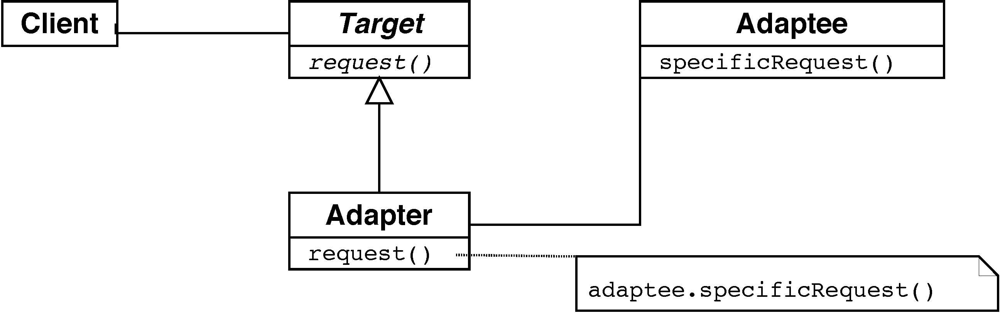

# Lenguajes

## Técnicas

- [Anónimos y cierres](#anonimos): Java lambdas, Ruby procs y blocks, Scala
- Mixins:
  - [Ruby modules](http://ruby-doc.com/docs/ProgrammingRuby/html/tut_modules.html)
  - [Scala traits](http://docs.scala-lang.org/tutorials/tour/traits)
    - Ejemplo: [Traits exercise](https://www.scala-exercises.org/std_lib/traits)
    - Ejemplo: [Stackable Traits pattern](http://www.artima.com/scalazine/articles/stackable_trait_pattern.html)
    - Lectura: [Herencia vs. composición con Scala mixins](http://baddotrobot.com/blog/2014/09/22/scala-mixins/)
- Reflexión
- Metaprogramación

## Paradigmas

 - Objetos
 - Eventos
 - Funcional


## Ejercicios

1. Interfaces funcionales - [Formateo de informes](#informes)
2. Cambio de interfaz - [Adaptadores](#adaptadores)
3. [Ruby from other languages](https://www.ruby-lang.org/en/documentation/ruby-from-other-languages/)
4. [Scala tour](http://docs.scala-lang.org/tutorials/tour/tour-of-scala)
5. [Scala exercises](https://www.scala-exercises.org/std_lib/)

# <span style="color:blue;"><a id="informes">Anónimos y cierres</a></span>

## Factorización de funciones

### Ejemplo: Comparación de personas - versión con herencia

Ordenación de una lista de nombres de personas:

```java
List<String> nombres = Arrays.asList("Melchor","Gaspar","Baltasar");
Collections.sort(nombres);
```

¿Cómo anticipar en la implementación la posible __variabilidad__ del criterio de ordenación?

- Definir una clase para las personas
- Factorizar la función de comparación: delegar en `compareTo(other)`
- Aprovechamos que el `String` del nombre ya implementa la interfaz `Comparable`

Delegando hacia las subclases:

```java
class Persona implements Comparable {
    private int idPersona;
    private String nombre;
    private java.util.Date fechaNacimiento;

    public Persona() { }
    public Persona(int idPersona, String nombre) {
        this.idPersona = idPersona;
        this.nombre = nombre;
    }

    public int getIdPersona() { return idPersona;  }
    public void setIdPersona(int idPersona) { this.idPersona = idPersona; }
    public String getNombre() { return nombre; }
    public void setNombre(String nombre) { this.nombre = nombre; }
    public java.util.Date getFechaNacimiento() { return fechaNacimiento; }
    public void setFechaNacimiento(java.util.Date fechaNacimiento) {
        this.fechaNacimiento = fechaNacimiento;
    }

    @Override
    public String toString() {
        return String.format("ID=%1s, Nombre:%2s", idPersona, nombre);
    }

    @Override
    public int compareTo(Persona otra) {
        return nombre.compareTo(otra.getNombre());
    }
}
```

Construir y ordenar una colección de personas:

```java
List<Persona> personas = new ArrayList<Persona>();
personas.add(new Persona(1, "Melchor"));
personas.add(new Persona(2, "Gaspar"));
personas.add(new Persona(3, "Baltasar"));
Collections.sort(personas);
```

¿Y si deseamos ordenar por fecha?

- Alternativa 1: definir subclases `PersonaPorNombre`, `PersonaPorFechaNacimiento`...
  - Mucho código repetido (no cumple DRY)
  - Muchos cambios si se añade un nuevo criterio (no cumple OCP)

- Alternativa 2: No usar herencia, sino composición (no delegar hacia las subclases)

### Ejemplo: Comparación de personas - versión con composición

Sin usar herencia:

```java
class OrdenarPersonaPorId implements java.util.Comparator<Persona> {
    public int compare(Persona o1, Persona o2) {
        return o1.getIdPersona() - o2.getIdPersona();
    }
}

Collections.sort(personas, new OrdenarPersonaPorId());
```

- Factorizar la función de comparación
- No delegar hacia las subclases
- Delegar en objeto de otra clase que implemente la interfaz `java.util.Comparator`

#### ¿Ventajas?

- La función factorizada (v.g. la implementación de `Comparator`) es sustituible en tiempo de ejecución mediante inyección de dependencias

### Ejemplo: Comparación de personas - versión con clases anónimas

```java
Collections.sort(
  personas, new java.util.Comparator<Persona>() {
    public int compare(Persona o1, Persona o2) {
      return o1.getIdPersona() - o2.getIdPersona();
    }
  }
);
```

### Clases locales

- Clases **locales**: declaradas dentro de métodos
- Las clases locales pueden hacer referencia a identificadores declarados en la clase y a variables de solo lectura (`final`) del método en que se declaran

```java
public class EnclosingClass {
  public class InnerClass {
    public int incrementAndReturnCounter() {
      return counter++;
    }
  }

  private int counter;
  {
    counter = 0;
  }

  public int getCounter() {
    return counter;
  }

  public static void main(String[] args) {
    EnclosingClass enclosingClassInstance = new EnclosingClass();
    EnclosingClass.InnerClass innerClassInstance =
      enclosingClassInstance.new InnerClass();
    for( int i = enclosingClassInstance.getCounter();
         (i = innerClassInstance.incrementAndReturnCounter()) < 10; ) {
      System.out.println(i);
    }
  }
}
```

### Predicados en Java 8 y en la biblioteca _guava_

En la biblioteca Guava, los [`Iterators`](https://google.github.io/guava/releases/15.0/api/docs/com/google/common/collect/Iterators.html) tienen un método [`filter`](https://google.github.io/guava/releases/15.0/api/docs/com/google/common/collect/Iterators.html#filter) que recibe un objeto de tipo [`Predicate`](https://google.github.io/guava/releases/15.0/api/docs/com/google/common/base/Predicate.html).
Desde Java 8 existe una clase similar [`Predicate`](https://docs.oracle.com/javase/8/docs/api/java/util/function/Predicate.html).

#### Ejemplo: partidos de una competición

- Con clases anónimas:
  ```java
  final Predicate<Match> condition = new Predicate<Match>() {
    final Team team1 = new Team("Cadiz CF");
    final Team team2 = new Team("RC Betis");
    public boolean apply(Match match) {
      return ( match.getLocalTeam().equals(team1) && match.getVisitingTeam().equals(team2) );
    }
  };
  Iterator matchesByTeam = Iterators.filter(matches, condition);
  for (matches: matchesByTeam) { ... };
  ```

- Sin clases anónimas:
  ```java
  class FilterByTeam implements Predicate<Match> {
    Team localTeam, visitingTeam;

    public FilterByTeam(Team t1, Team t2) {
        this.localTeam = t1;
        this.visitingTeam = t2;
    }

    public boolean apply(Match match) {
        return match.getLocalTeam().equals(t1) || match.getVisitingTeam().equals(t2);
    }
  }
  ```
  Comprobar que, en un cierto grupo de la competición, un mismo partido no está repetido ni se enfrenta un equipo contra sí mismo:
  ```java
  private void checkMatchesInGroup(List<Match> matchesInGroup) {
    for (Match match: matchesInGroup) {
        Team t1 = match.getLocalTeam();
        Team t2 = match.getVisitingTeam();
        assertNotSame(t1, t2);
        List<Match> firstLeg = FluentIterable.from(matchesInGroup)
                                             .filter(new FilterByTeam(t1, t2))
                                             .toImmutableList();
        assertTrue(firstLeg.size()==1);
        List<Match> secondLeg = FluentIterable.from(matchesInGroup)
                                              .filter(new FilterByTeam(t2, t1))
                                              .toImmutableList();
        assertTrue(secondLeg.size()==0);
    }
  }
  ```

### Clases anónimas interiores (_inner_)

- Son clases locales declaradas sin nombre; sirven para clases que solo aparecen una vez en la aplicación

- Usando Java 7:
  ```java
  class CalculationWindow extends JFrame {
    private volatile int result;
    public void calculateInSeparateThread(final URI uri) {
      new Thread(
        new Runnable() {
          void run() {
            calculate(uri);
            result = result + 10;
          }
        }
      ).start();
    }
  }
  ```
- Usando Java 8:
  ```java
  class CalculationWindow extends JFrame {
    private volatile int result;
    public void calculateInSeparateThread(final URI uri) {
      // code () -> { /* code */ } is a closure
      new Thread(() -> {
        calculate(uri);
        result = result + 10;
      }).start();
    }
  }
  ```

### Retrollamadas (_callbacks_)

_callback_ = Fragmento de código ejecutable que se pasa como argumento

#### Implementaciones en C/C++

- Puntero a función:
    ```c
      int (*f)(void)
    ```
- Con puntero asociado a datos:
    ```c
      void (*f)(void *data)
    ```
- _functor_ en C++
  - clase que define `operator()`
  - es una clase y por tanto pueden contener un estado

##### Ejemplo de puntero a función

```c
/* The calling function takes a single callback as a parameter. */
void PrintTwoNumbers(int (*numberSource)(void)) {
    printf("%d and %d\n", numberSource(), numberSource());
}

/* Possible callbacks */
int overNineThousand(void) {
    return (rand() % 1000) + 9001;
}

int meaningOfLife(void) {
    return 42;
}

int main(void) {
    PrintTwoNumbers(&rand);
    PrintTwoNumbers(&overNineThousand);
    PrintTwoNumbers(&meaningOfLife);
    return 0;
}
```

##### Ejemplo de puntero a datos

```c
/* Type of function used for the callback */
typedef void (*event_cb_t)(const struct event *evt, void *userdata);

/* Define a function to register a callback */
int event_cb_register(event_cb_t cb, void *userdata);

/ * Register the callback */
static void my_event_cb(const struct event *evt, void *data)
{
    /* do stuff and things with the event */
}

event_cb_register(my_event_cb, &my_custom_data);

/* struct to store the callback in the event dispatcher */
struct event_cb {
    event_cb_t cb;
    void *data;
};

/* Execute the callback */
struct event_cb *callback;
...
callback->cb(event, callback->data);
```

##### Ejemplo de functor

```cpp
// this is a functor
struct add_x {
  add_x(int x) : x(x) {}
  int operator()(int y) { return x+y; }

  private:
    int x;
};

add_x add42(42);     // create an instance of the functor class
int i = add42(8);    // and "call" it
assert(i == 50);     // and it added 42 to its argument

std::vector<int> in; // assume this contains a bunch of values
std::vector<int> out;
// Pass a functor to std::transform, which calls the functor on every element 
// in the input sequence, and stores the result to the output sequence
std::transform(in.begin(), in.end(), out.begin(), add_x(1)); 
assert(out[i] == in[i] + 1); // for all i
```

##### Functor vs function pointer

```cpp
//Functor
struct add_x {
  add_x(int y):x(y){}
  int operator()(int y) { return x+y; }

  private:
    int x;
};

//Function pointer
int (func)(int x)
{
    return ++x;
}

std::vector<int> vec();
//fill vec with 1 2 3 4 5

int (*f)(int) = func; // function pointer initialization
std::transform(vec.begin(),vec.end(),f);        // pass function pointer
std::transform(vec.begin(),vec.end(),add_x(1)); // pass functor
```

### Funciones anónimas (lambdas)

#### Función anónima

- Función o subrutina definida y (posiblemente) llamada sin necesidad de asociarla a un identificador o nombre
- Se suelen pasar como argumento a funciones de orden superior
- Son funciones anidadas que permiten acceder a variables definidas en el ámbito de la contenedora (variables no locales)
- Muchos lenguajes las introducen a través de la palabra reservada `lambda`

#### Mecanismos de los lenguajes

- En C++: funciones anónimas, objetos función (_functors_) o [funciones lambda](http://en.cppreference.com/w/cpp/language/lambda) (desde C++11)
- En Java 8: [expresiones lambda](http://www.oracle.com/webfolder/technetwork/tutorials/obe/java/Lambda-QuickStart/index.html)
- En Ruby: [blocks, procs y lambdas](https://www.blackbytes.info/2016/02/ruby-procs-and-lambdas/)
- En C\#: [delegates](https://msdn.microsoft.com/en-us/library/ms173171.aspx) (métodos anónimos y expresiones lambda)
- En Python: [generators, comprehensions, lambda expressions](https://docs.python.org/2/howto/functional.html)


#### Cierre de funciones (_closures_)
- __Cierre__: Función o referencia a función junto con un _entorno de referencia_
- __Entorno de referencia__: tabla que guarda una referencia a cada una de las variables no locales (_libres_) de la función
  - __Variable libre__ (_free_): notación lógica matemática que especifica los lugares de una expresión donde tiene lugar una sustitución
  - __Variable asignada__ (_bound_): variable que era libre previamente pero a la que le ha sido asignado un valor o conjunto de valores
- Un cierre permite acceder a las variables libres incluso cuando se invoca desde fuera de su ámbito léxico

#### Funciones anónimas en C++

```cpp
std::vector<int> some_list; // assume that contains something
int total = 0;
for (int i=0;i<5;++i) some_list.push_back(i);
std::for_each(
  begin(some_list),
  end(some_list),
  [&total](int x) { total += x; }
);
// Computes the total of all elements in the list.
/* Variable total is stored as a part of the lambda function's closure.
   Since it is a reference to the stack variable total, it can change
   its value. */
```

#### Funciones anónimas en Java

- Con clases anónimas (Java 7):
  ```java
  public class ComparatorTest { 
    public static void main(String[] args) {

      List<Person> personList = Person.createShortList();

      Collections.sort(personList, new Comparator<Person>(){
        public int compare(Person p1, Person p2){
          return p1.getLastname().compareTo(p2.getLastname());
        }
      });

      System.out.println("=== Sorted Asc Lastname ===");
      for(Person p:personList){
        p.printName();
      }

    }
  }
  ```
- Con lambdas (Java 8)
  ```java
  public class ComparatorTest { 
    public static void main(String[] args) {

      List<Person> personList = Person.createShortList();

      // Print Asc
      System.out.println("=== Sorted Asc Lastname ===");
      Collections.sort(personList, (Person p1, Person p2) ->
        p1.getLastname().compareTo(p2.getLastname()));

      for(Person p:personList){
        p.printName();
      }

      // Print Desc
      System.out.println("=== Sorted Desc Lastname ===");
      Collections.sort(personList, (p1,  p2) ->
        p2.getLastname().compareTo(p1.getLastname()));

      for(Person p:personList){
        p.printName();
      }

    }
  }
  ```

##### Ejercicio: [Mejorando código con expresiones lambda](http://www.oracle.com/webfolder/technetwork/tutorials/obe/java/Lambda-QuickStart/index.html\#section3)

#### Funciones anónimas en Ruby

##### Bloques (_blocks_)

Sintaxis `do` ... `end`

```ruby
some_list = [ 10, 20, 30 ]
some_list.map do |i|
    i += 1
end
```

Sintaxis `{` ... `}`

```ruby
some_list = [ 10, 20, 30 ]
some_list.map { |i| i += 1 }
```

El método `map` itera y aplica un bloque repetitivamente a cada elemento de una colección (representado por el parámetro `i`)

Ejemplo: búsqueda en una lista

- Sin bloques:
  ```ruby
  class SongList
    def with_title(title)
      for i in 0...@songs.length
        return @songs[i] if title == @songs[i].name
      end
      return nil
    end
  end
  ```
- Con bloques (sintaxis `do` ... `end`):
  ```ruby
  class SongList
    def with_title(title)
      @songs.find do |song|
        title == song.name
      end
    end
  end
  ```
- Con bloques (sintaxis `{` ... `}`):
  ```ruby
  class SongList
    def with_title(title)
      @songs.find { |song| title == song.name }
    end
  end
  ```

El método `find` itera y aplica el test del bloque a cada elemento `song` de la colección.

##### Ejecución de bloques

- El bloque debe aparecer al lado de una llamada a método
- No se ejecuta el bloque, sino que se recuerda el contexto (variables locales, objeto actual, etc.) en que aparece
- Cuando se ejecuta el método, el bloque es invocado donde aparezca `yield`
- El control vuelve al método después del `yield`
- Al bloque se le pueden pasar parámetros

Ejemplo de `yield`:

```ruby
def three_times
  yield
  yield
  yield
end
three_times { puts "Hello" }
```

Ejemplo: fibonacci

```ruby
def fib_up_to(max)
  i1, i2 = 1, 1
  while i1 <= max
    yield i1
    i1, i2 = i2, i1+i2
  end
end
fib_up_to(1000) {|f| print f, " " }

#Salida => 1 1 2 3 5 8 13 21 34 55 89 144 233 377 610 987
```

Ejemplo: implementación de `Array.find`

```ruby
class Array
  def find
    for i in 0...size
      value = self[i]
      return value if yield(value)
    end
    return nil
  end
end
```

Ejemplos: iterar con bloques

```ruby
[ 1, 3, 5, 7, 9 ].each {|i| printf i, " " }

#Salida => 1 3 5 7 9
```

```ruby
f = File.open("testfile")
f.each do |line|
  puts line
end
f.close
f = File.open("testfile")
f.each {|line| puts line}
f.close
```

```ruby
["H", "A", "L"].collect {|x| x.succ }
# Salida => [''I'', ''B'', ''M'']
```

##### Procs y lambdas

- En Ruby, una función anónima o _lambda_ es simplemente un tipo especial de objeto __`Proc`__
- Sintaxis:
  ```ruby
  # sin argumentos:
  say_something = -> { puts "This is a lambda" }
  say_something = lambda { puts "This is a lambda" }
  say_otherwise = Proc.new { puts "This is a proc" }
  # con argumentos:
  times_two = ->(x) { x * 2 }
  ```
- Varias formas de llamar a la lambda (es preferible `call`)
  ```ruby
  say_something = -> { puts "This is a lambda" }
  say_something.call
  say_something.()
  say_something[]
  say_something.===

  say_otherwise = Proc.new { puts "This is a proc" }
  say_otherwise.call

  times_two = ->(x) { x * 2 }
  times_two.call(10) 
  ```
- Los `proc` no se preocupan de los argumentos:
  ```ruby
  t = Proc.new { |x,y| puts "I don't care about arguments!" }
  t.call
  ```
- Los proc retornan del método actual:
  ```ruby
  # funciona:
  my_lambda = -> { return 1 }
  puts "Lambda result: #{my_lambda.call}"

  # eleva una exceción:
  my_proc = Proc.new { return 1 }
  puts "Proc result: #{my_proc.call}"
  ```
- Si el proc está dentro de un método, la llamada a `return` es equivalente a retornar de ese método:
  ```ruby
  def call_proc
    puts "Before proc"
    my_proc = Proc.new { return 2 }
    my_proc.call
    puts "After proc"
  end

  puts call_proc
  # Prints "Before proc" but not "After proc"
  ```

__Diferencias__ entre `Proc` y `lambda`:

- Las lambdas se definen con `-> {}` y los procs con `Proc.new {}`
- Los `Proc` retornan del método actual, las lambdas retornan de la propia función lambda
- Los `Proc` no se preocupan del número correcto de argumentos, las lambdas elevan una excepción

### Lecturas recomendadas

- M. Williams: [Java SE 8: Lambda Quick Start](http://www.oracle.com/webfolder/technetwork/tutorials/obe/java/Lambda-QuickStart/index.html), Oracle Learning Library, 2013.
- D. Thomas & A. Hunt: [Programming Ruby. The Pragmatic Programmer's Guide](http://www.ruby-doc.org/docs/ProgrammingRuby/), Addison-Wesley, 2005.

# <a id="informes">Ejercicio 1 - Interfaces funcionales</a>

## Formateo de informes

### Versión en ruby

```ruby
class Report
  attr_reader :title, :text
  attr_accessor :formatter
  def initialize(formatter)
    @title = 'Informe mensual'
    @text = ['Todo marcha', 'muy bien.']
    @formatter = formatter
  end
  def output_report()
    @formatter.output_report(self)
  end
end
class HTMLFormatter
  def output_report(context)
    puts('<html>')
    puts(' <head>')
    # Output The rest of the report ...
    puts(" <title>#{context.title}</title>")
    puts(' </head>')
    puts(' <body>')
    context.text.each do |line|
      puts(" <p>#{line}</p>")
    end
    puts(' </body>')
    puts('</html>')
  end
end
  
class PlainTextFormatter
  def output_report(context)
    puts("***** #{context.title} *****")
    context.text.each do |line|
```

#### Procs
- Proc = objeto función = objeto que solo contiene un trozo de código 
 
```ruby
hello = lambda do
  puts('Hello')
  puts('I am inside a proc')
end
```

#### Blocks

- Code block = Función anónima, cierre o lambda
- Es la parte `do` ... `end`
- Simplificada como  `{` ... `}`

```ruby
hello = lambda {
  puts('Hello, I am inside a proc')
}
```

- Parametrizable

```ruby
multiply = lambda {|x, y| x * y}

n = multiply.call(20, 3)
puts(n)  #60
n = multiply.call(10, 50)
puts(n)  #500
```

#### Llamada 

```ruby
name = 'John'
proc = Proc.new do
  name = 'Mary'
end

proc.call
puts(name)
```


#### Paso de bloques como parámetros

- Simplemente, se añade al final de la llamada a un método 
- ¿Dónde se llama al bloque? Donde el método indique con `yield`
- El bloque (realmente un objeto `Proc`) se pasa como una especie de parámetro invisible
 
```ruby
def run_it
  puts("Before the yield")
  yield
  puts("After the yield")
end
```
```ruby
run_it do
  puts('Hello')
  puts('Coming to you from inside the block')
end
```
Salida:

```
Before the yield
Hello
Coming to you from inside the block
After the yield
```

- Llamada a un bloque con parámetros:

```ruby
def run_it_with_parameter
  puts('Before the yield')
  yield(24)
  puts('After the yield')
end

run_it_with_parameter do |x|
  puts('Hello from inside the proc')
  puts("The value of x is #{x}")
end
```
Salida:

```
Before the yield
Hello from inside the proc
The value of x is 24
After the yield
```

- Hacer explícito el bloque pasado como parámetro: _ampersand_

```ruby
def run_it_with_parameter(&block)
  puts('Before the call')
  block.call(24)
  puts('After the call')
end
```
Y para convertir un `Proc` en un bloque pasado como parámetro:

```ruby
my_proc = lambda {|x| puts("The value of x is #{x}")}
run_it_with_parameter(&my_proc)
```

### Versión con interfaces funcionales (Ruby procs + blocks)

```ruby
class Report
  attr_reader :title, :text
  attr_accessor :formatter
  
  def initialize(&formatter)
    @title = 'Monthly Report'
    @text = [ 'Things are going', 'really, really well.' ]
    @formatter = formatter
  end
  
  def output_report
    @formatter.call( self )
  end
end
```

Formateo HTML:

```ruby
HTML_FORMATTER = lambda do |context|
  puts('<html>')
  puts(' <head>')
  puts("   <title>#{context.title}</title>")
  puts(' </head>')
  puts(' <body>')
  context.text.each do |line|
    puts("  <p>#{line}</p>" )
  end
  puts(' </body>')
  puts

report = Report.new &HTML_FORMATTER
report.output_report
```

Formateo de texto:

```ruby
report = Report.new do |context|
  puts("***** #{context.title} *****")
  context.text.each do |line|
    puts(line)
  end
end
```

<a id="adaptadores">
# Ejercicio 2 - Cambio de interfaz
</a>

## Adaptadores

###Tipos de adaptador:

- Adaptadores de clase

  

- Adaptadores de objeto

    

### Implementaciones:

- Herencia
- Composición
- Herencia múltiple
- Mixins

### Mixins

En POO, un __mixin__ es una clase con métodos disponibles para otras clases sin tener que ser madre de estas otras (es decir, sin usar la herencia)

- Es una alternativa a la herencia múltiple
- Es una interfaz con métodos ya implementados
- No se _heredan_ sino que se _incluyen_
- Es una forma de implementar el principio de inversión de dependencias (DIP)

### Ejemplo en ruby: `modules` e `include`

Una manera de implementar un `Comparable` en ruby mediante el módulo [Comparable](https://ruby-doc.org/core-2.2.3/Comparable.html):

```ruby
class Student
  include Comparable # The class Student inherits Comparable module using include keyword
  attr_accessor :name, :score

  def initialize(name, score)
    @name = name
    @score = score
  end

  # Including the Comparison module, requires the implementing class to define the <=> comparison operator
  # Here's the comparison operator. We compare 2 student instances based on their scores.

  def <=>(other)
    @score <=> other.score
  end

  # Here's the good bit - I get access to <, <=, >,>= and other methods of the Comparable Interface for free.
end

s1 = Student.new("Peter", 100)
s2 = Student.new("Jason", 90)
s3 = Student.new("Maria", 95)

s1 > s2 #true
s1 <= s2 #false
s3.between?(s1,s2) #true
```

- La clase que incluye el módulo `Comparable` tiene que implementar:
  - el método `<=>`: es un método que incluye los siguientes operadores/métodos: `<, <=, ==, >, >=, between?` 
  - el atributo-criterio de comparación
  - En `x <=> y`, `x` es el receptor del mensaje/método e `y` es el argumento


## Módulos Ruby


### Interfaz americana

```ruby
class Renderer
  def render(text_object)
    text = text_object.text
    size = text_object.size_inches
    color = text_object.color
    
    # render the text ...
  end
end
```
```ruby
class TextObject
  attr_reader :text, :size_inches, :color
  
  def initialize(text, size_inches, color)
    @text = text
    @size_inches = size_inches
    @color = color
  end
end
```

### Interfaz británica

```ruby
class BritishTextObject
  attr_reader :string, :size_mm, :colour
  
  # ...
end
```

### Adaptador de interfaz: versión clásica

```ruby
# british_text_object.rb
class BritishTextObjectAdapter < TextObject
  def initialize(bto)
    @bto = bto
  end

  def text
    return @bto.string
  end
  
  def size_inches
    return @bto.size_mm / 25.4
  end

  def color
    return @bto.colour
  end
end
```

### Adaptador de interfaz: versión ruby

```ruby
# Make sure the original class is loaded
require 'british_text_object'

# Now add some methods to the original class
class BritishTextObject
  def color
    return colour
  end

  def text
    return string
  end
  
  def size_inches
    return size_mm / 25.4
  end
end
```

- `require` carga la clase original
- la reescritura de métodos modifica la clase, no la declara de nuevo
- se puede hacer incluso con las clases built-in de la biblioteca de Ruby


### Adaptador de interfaz: instancias únicas 

```ruby
bto = BritishTextObject.new('hello', 50.8, :blue)

class << bto
  def color
    colour
  end

  def text
    string
  end

  def size_inches
    return size_mm/25.4
  end
end
```
o bien:

```ruby
def bto.color
  colour
end

def bto.text
  string
end
# ...
```

- Modifica el comportamiento solo de 1 instancia
- Ruby llama a esto _singleton methods_ y _singleton class_ (no es exactamente lo mismo que el patrón singleton del GoF)
- Ruby primero busca los métodos definidos en una clase singleton y luego en la clase regular que ha sido redefinida

## Scala Traits

### Ejemplo: Similarity

```scala
trait Similarity {
  def isSimilar(x: Any): Boolean
  def isNotSimilar(x: Any): Boolean = !isSimilar(x)
}
```
```scala
class Point(xc: Int, yc: Int) extends Similarity {
  var x: Int = xc
  var y: Int = yc
  def isSimilar(obj: Any) =
    obj.isInstanceOf[Point] &&
    obj.asInstanceOf[Point].x == x
}
object TraitsTest extends App {
  val p1 = new Point(2, 3)
  val p2 = new Point(2, 4)
  val p3 = new Point(3, 3)
  println(p1.isNotSimilar(p2))  //false
  println(p1.isNotSimilar(p3))  //true
  println(p1.isNotSimilar(2))   //true
}
```

- Polimorfismo usa la herencia
- Mixin es un mecanismo de reutilización de código

¿Usar traits con comportamiento va contra el principio general de que la [herencia de comportamiento](https://en.wikipedia.org/wiki/Composition_over_inheritance#Benefits) es una mala idea?

- Odersky llama _mixin traits_ a los traits con comportamiento
- Para ser un mixin genuino, debería mezclar comportamiento y no interfaces heredadas
- Leer [Scala Mixins: The right way](http://baddotrobot.com/blog/2014/09/22/scala-mixins/)

### Ejemplo: Iterator

Mixin-class composition

```scala
abstract class AbsIterator {
  type T
  def hasNext: Boolean
  def next: T
}

trait RichIterator extends AbsIterator {
  def foreach(f: T => Unit) { while (hasNext) f(next) }
}

class StringIterator(s: String) extends AbsIterator {
  type T = Char
  private var i = 0
  def hasNext = i < s.length()
  def next = { val ch = s charAt i; i += 1; ch }
}    

object StringIteratorTest {
  def main(args: Array[String]) {
    class Iter extends StringIterator(args(0)) with RichIterator
    val iter = new Iter
    iter foreach println
  }
}
```    
- [Unit](http://www.scala-lang.org/api/current/scala/Unit.html) en scala: método Java que devuelve `void`

###Diferencia con clase abstracta

- [Scala traits vs abstract classes](http://stackoverflow.com/questions/1991042/what-is-the-advantage-of-using-abstract-classes-instead-of-traits)
- Los constructores de traits no pueden tener parámetros

#### Reglas:

[To trait or not to trait](http://www.artima.com/pins1ed/traits.html#12.7)

- Si no se va a reutilizar el comportamiento => clase concreta
- Si se va a reutilizar en varias clases no relacionadas entre sí => trait (mixin)
- Si hace falta heredarlo en código Java => clase abstracta
- Si se va a distribuir compilado y se va a heredar => clase abstracta
- Si importa mucho la eficiencia => clase (los traits se compilan a interfaces y son algo más lentas de llamar)
- Si no se sabe => empezar por un trait y cambiarlo cuando se sepa
