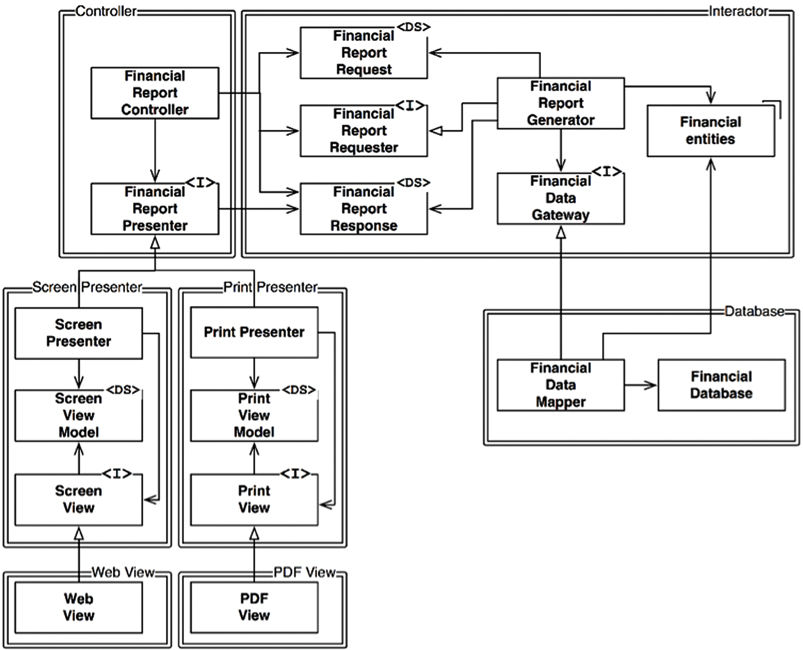

<!-- size: 16:9 -->
<!-- theme: default -->

<style>
h1 {
  text-align: center;
}
h2 {
  color: darkblue;
  text-align: center;
}
</style>

# DISEÑO DE SISTEMAS SOFTWARE

 
<style scoped>
h2 {
  text-align: left;
}
</style>


## Bloques

1. Principios de diseño OO
2. Patrones de diseño
3. Arquitectura de software

---

# ARQUITECTURA DE SOFTWARE 

---

## Índice de contenidos

1. Introducción
2. Componentes software
3. Principios arquitectónicos
4. Patrones de arquitectura
5. Modelado de arquitecturas

---

## Introducción
---

### Arquitectura

- La arquitectura de un sistema software es el conjunto de __decisiones de diseño__ principales realizadas sobre el sistema. 

- Son los planos para la __construcción__ y la __evolución__ de un sistema software.

- Una __arquitectura de referencia__ se refiere al conjunto de decisiones  de diseño que se pueden aplicar simultáneamente a varios sistemas relacionados, dentro de un __dominio__ de aplicación y con puntos de __variación__ definidos explícitamente. Sirven de base para las __lineas de productos software__.


---
### Atributos de calidad

En el diseño de la arquitectura hay que tener presente no solo los requisitos funcionales, sino también las propiedades no funcionales del software, que definen sus aspectos de calidad: 

- Adecuación funcional: corrección y completitud
- Fiabilidad: disponibilidad, tolerancia a fallos y capacidad de recuperación
- Eficiencia: rendimiento y consumo adecuado de recursos
- Operabilidad: usabilidad y accesibilidad 
- Seguridad: confidencialidad, integridad y no repudio
- Compatibilidad: reemplazabilidad e interoperabilidad con sistemas externos y legados
- Mantenibilidad: facilidad de modificación, de extensión, de prueba y de reutilización
- Transferibilidad: portabilidad, adaptabilidad y facilidad de instalación

Algunos de estos aspectos son, en ocasiones, "conflictivos”.


---
### Decisiones de diseño


  - **Estructura** del sistema: v.g. "Los elementos arquitectónicos se organizarán y compondrán exactamente de forma que..."
  - **Interacción**: v.g. "La comunicación entre los elementos del sistema se hará mediante notificaciones de eventos"
  - La **implementación** del sistema: v.g. "Los componentes de interfaz de usuario se construirán usando Java Swing"
  - Tácticas para abordar las propiedades **no funcionales** del sistema: v.g. "La confiabilidad del sistema se asegurará mediante módulos de procesamiento duplicados"
  - Aspectos de **negocio** tales como el tiempo de lanzamiento al mercado, coste y beneficio, etc.,
  

---

### Importancia de la arquitectura software
La finalidad de la arquitectura es __facilitar__ el _desarrollo_, _despliegue_, _operación_ y _mantenimiento_ del sistema software.

- Proporcionan un __lenguaje común__ para expresar, negociar y resolver los diferentes intereses de los participantes
- Condicionan la __estructura organizativa__ del equipo de desarrollo
- Permite una __estimación__ más exacta de los costes y planificación
- Las arquitecturas pueden constituirse como la base para la __formación__ de nuevos miembros del proyecto
---

### Granularidad

Las aplicaciones crecen en tamaño y complejidad y se requiere algún tipo de organización
1. La __clase__ es de un grano demasiado fino como unidad de organización
2. En UML, Java y otros lenguajes se da el concepto de __paquete__ (*package*)
3. En general puede hablarse de __módulos__ o __componentes__, como _agrupaciones lógicas de declaraciones que pueden importarse en otros programas_

---

## Componentes software
---

--- 
### Arquitectura basada en componentes

> La arquitectura de un sistema software es la forma dada al sistema por aquellos que lo construyen. La forma es la división del sistema en componentes, la disposición de esos componentes y la manera en que se comunican entre sí.
>
> **Bob Martin**


---


### Definición de _componente software_

> Un componente software es una unidad de composición binaria con interfaces especificadas contractualmente y dependencias explicitas del contexto. Un componente software se puede instalar independientemente, está sujeto a composición por terceros y no tiene estado.
>
> **Szyperski**

- Son la expresión tangible de los __principios__ de encapsulación, abstracción y modularidad.

---

<!-- Un componente software es una entidad arquitectónica que:

  1. Encapsula un subconjunto de las __funciones__ y/o __datos__ (i.e. computación + estado) del sistema
  2. Restringe el acceso a dicho subconjunto vía una __interfaz__ explícitamente definida
  3. Tiene __dependencias__ explícitamente definidas de su __contexto__ de ejecución requerido.
-->


#### Unidad de composición

- La verdadera __industrialización__ del software (en contrapartida al desarrollo artesanal) se basa, como en el resto de ingenierias, en el desarrollo a partir de *componentes* prefabricados que pueda disponer la empresa de desarrollo.

- La existencia y disponibilidad de los componentes deben considerarse durante todo el __ciclo de vida del software__, desde el planteamiento de la oferta y el análisis de requisitos, hasta el diseño, implementación y pruebas.

---

#### Binaria _(machine-procesable)_
- Este termino hace referencia a la necesidad de que los componentes sean directamente __procesables por la maquina__, es decir, que no se requiera intervención humana (compilación, preprocesamiento, etc.) para que puedan funcionar. 
- Así pues, un trozo de código __no__ podríamos considerarlo como un componente software. 

---
#### Interfaces
- Las interfaces son la vía de comunicación de los componentes con el exterior. Las interfaces están compuestas por cero o más métodos. 
- Podemos tener lenguajes de programación como C++ o PHP, en donde cada interfaz tiene una sola implementación, o lenguajes como Java o C#, donde una misma interfaz puede ser implementada por distintas clases.
- Las interfaces de *entrada* está pensadas para que el cliente pueda usar las implementaciones que proporciona un determinado componente. Sin embargo, las interfaces de *salida* están pensadas para ser usadas desde dentro del componente. 

---

#### Especificación contractual
- Un contrato es la especificación de un conjunto de restricciones de uso de un determinado componente software. 
- Suelen recogerse mediante hojas de especificación en lenguaje natural o en formato electrónico procesable por la maquina. Las especificaciones electrónicas son las mejores, ya que así podremos observar posibles errores en tiempo de compilación.
- Los contratos deben contemplar la sintaxis de las llamadas a los métodos, su semántica y aspectos no funcionales como la trazabilidad, portabilidad, persistencia, etc.

---
#### Dependencias explícitas del contexto

Son los elementos que se necesitan para que el componente pueda funcionar correctamente. El contexto de ejecución requerido consta de:
 - Las configuraciones hardware necesarias.
 - El software de sistema requerido (v.g. runtime del lenguaje de programación, middleware, sistema operativo, protocolos de red, drivers de dispositivos, etc.)
 - La disponibilidad de recursos específicos (v.g. ficheros de datos, directorios, etc.)
  - La interfaz de salida requeridas (proporcionadas por otros componentes)

---
#### Instalación independiente
Tiene dos vertientes diferentes:
-	Independencia de vendedor: Al instalar un determinado componente, no  se requiere la instalación de otro de un determinado fabricante.
-	Unidad atómica: El componente se instala completamente o no se instala, por tanto no existe instalación parcial.


---
#### Composición por terceros (y sin estado)
- Un componente debe tener sentido tanto para la organización que lo desarrolla como para otras. Si solo lo tiene para el propio fabricante, no deberíamos considerarlo componente.

- Los componentes no tienen estado interno, por lo que no cambia por dentro. Si un componente tuviese estado, entonces el mantenimiento de los componentes seria diferente para cada cliente.


---
#### _Cuestionario_ sobre componentes (I)
- ¿Un objeto en Java es un componente?

- ¿Un botón de una determinada GUI es un componente?

- ¿Una clase Java es un componente?

- ¿Un paquete en Java es un componente?

---
#### _Cuestionario_ sobre componentes (I) [respuestas]
- ¿Un objeto en Java es un componente?
No, ya que tiene estado, no puede instalarse, etc.

- ¿Un botón de una determinada GUI es un componente?
No, debido a que tienen estado, y son instalables, entre otros.

- ¿Una clase Java es un componente?
No, debido a que no es “binario” y no puede instalarse.

- ¿Un paquete en Java es un componente?
Un paquete en Java supera todas las condiciones para ser un componente, excepto que un paquete no puede instalarse independientemente. Así pues, no es un componente.

---
#### _Cuestionario_ sobre componentes (II)
- ¿Un fichero mp3 es un componente?

- ¿Un servicio web es un componente?

- ¿La API para trabajar con XML en Java –Xerces.jar- es un componente?

- ¿La librería de Linux Glibc-2.3.a, es un componente?


---
#### _Cuestionario_ sobre componentes (II) [respuestas]
- ¿Un fichero mp3 es un componente?
No, ya que no tiene interfaz, no sirve para componer, etc.. Es un recurso.

- ¿Un servicio web es un componente?
Si, ya que pasa todas las condiciones.

- ¿La API para trabajar con XML en Java –Xerces.jar- es un componente?
Si, ya que pasa todas las condiciones.

- ¿La librería de Linux Glibc-2.3.a, es un componente?
Si, lo podemos considerar como componente.


---

<!--
#### Preguntas

- ¿Mejor criterio de partición?
- ¿Qué relaciones hay entre componentes y qué principios de diseño gobiernan su uso?
- En diseño OO, ¿los componentes deben diseñarse antes que las clases, o al revés?
- ¿Cómo se representan físicamente los componentes?
- ¿Para qué usaremos esos componentes?

-->

## Principios de Diseño Arquitectónico
---


### Principios de diseño SOLID
- __S__ ingle responsibility principle
A class should only have a single responsibility, that is, only changes to one part of the software's specification should be able to affect the specification of the class.

- __O__ pen–closed principle
"Software entities ... should be open for extension, but closed for modification."

- __L__ iskov substitution principle
"Objects in a program should be replaceable with instances of their subtypes without altering the correctness of that program." 

- __I__ nterface segregation principle
"Many client-specific interfaces are better than one general-purpose interface."

- __D__ ependency inversion principle
One should "depend upon abstractions, [not] concretions."

---

### Implicaciones de SOLID en arquitectura
- __S__ ingle responsibility principle
Un módulo debería ser solo responsable de uno y solo un actor o stakeholder. 

- __O__ pen–closed principle
El comportamiento de un artefacto software debe ser extensible sin tener que modificarlo. 

- __L__ iskov substitution principle
Inicialmente vinculado a la *herencia* de clases, hoy se considera más ligado a la acción de remplazar las implementaciones de interfaces (locales o remotas ReST). 

- __I__ nterface segregation principle
No depender de módulos que contienen más de lo que se necesita. Depender de algo que trae "equipaje" innecesario puede ser origen de problemas.

- __D__ ependency inversion principle
Es importante no mencionar nunca el nombre de algo concreto y volátil en el código, referirse solo a abstracciones.
---

##### Ejemplo de OCP y DIP en arquitectura (diagrama UML de componentes)


---


##### Ejemplo de OCP y DIP en arquitectura (diagrama UML de clases)



---

##### Ejemplo de violación de LSP en arquitectura 

- Un servicio agregador de taxis (uber, cabify, mitaxi, acme, etc.)
- La URI con que se llama al taxi se guarda en la base de datos en formato ReST:
    `mitaxi.com/driver/Bob`
- El agregador añade la información de pedido y hace PUT a la URI:
    ```text
    mitaxi.com/driver/Bob
      /pickupAddress/24 Maple St.
      /pickupTime/153
      /destination/ORD
    ```
- Todos los taxis de diferentes compañías deben cumplir la misma interfaz ReST.
- La compañía ACME resulta que abrevia el destino en la URI con `dest`

---

- Ahora la petición hay que construirla siguiendo una reglas distintas para cada conductor:
    `if (driver.getDispatchUri().startsWith("acme.com")) ...`

- Pero meter "`acme.com`" en el código puede ser origen de fallos y brechas de seguridad. Aún peor: ACME compra a MiTaxi y unifica los sistemas informáticos.

- Las interfaces de los servicios ReST no son sustituibles, por lo que la mejor opción es definir un módulo adicional que decide el formato en función de la URI:

 URI   |  Dispatch format
:-------------------------:|:-------------------------:
`acme.com` | `pickupAddress/%s/pickupTime/%s/dest/%s`
`*.*`      | `pickupAddress/%s/pickupTime/%s/destination/%s`

---
<!--
La LSP debería extenderse hasta el nivel arquitectónico.
 Una violación de la posibilidad de sustitución puede contaminar la arquitectura de un sistema con mecanismos extra.

#### SRP en arquitectura

_**Lectura recomendada**_: Bob Martin: [Clean Architecture](bibliografia.html#cleanarch), chapter 7

> A module should be responsible to one, and only one, user / stakeholder / **actor**.
> ––Robert C. Martin (2018): [Clean Architecture: A Craftsman's Guide to Software Structure and Design](bibliografia.html#cleanarch). 


#### OCP en arquitectura

- El comportamiento de un artefacto software debería ser extensible sin tener que modificarlo.

- Los componentes de mayor nivel en la jerarquía deben quedar protegidos de los cambios en los componentes de nivel inferior.

_**Lectura recomendada**_: Bob Martin: [Clean Architecture](bibliografia.html#cleanarch) chapter 8

- A nivel arquitectónico, la aplicación de OCP separa las funcionalidades a partir de cómo, por qué y cuándo éstas pueden cambiar, y luego organiza cada funcionalidad separada en una jerarquía de componentes.
> ––Robert C. Martin (2018): [Clean Architecture: A Craftsman's Guide to Software Structure and Design](bibliografia.html#cleanarch). 


#### LSP en arquitectura


En OO, el principio LSP nació ligado al uso de la **herencia** de clases para el diseño software.
Hoy día, se considera más ligado al diseño de **interfaces** e **implementaciones**. Por ejemplo:

- Una interfaz Java implementada por varias clases
- Varias clases Ruby con las mismas signaturas
- Un conjunto de servicios con la misma interfaz ReST

LSP es aplicable porque habrá usuarios que dependan de interfaces bien definidas y de poder sustituir las implementaciones de estas interfaces.

_**Lectura recomendada**_: Bob Martin: [Clean Architecture](bibliografia.html#cleanarch) chapter 9

-->

<!--
#### DIP en arquitectura

- Los sistemas más flexibles son aquellos en que las dependencias en el código fuente se refieren solo a abstracciones y no a cosas concretas. Por ello es importante no mencionar nunca el nombre de algo concreto y volátil en el código.

- Las dependencias están invertidas con respecto al flujo de control


_**Lectura recomendada**_: Bob Martin: [Clean Architecture](bibliografia.html#cleanarch) chapter 11

-->

<!--
ISP en arquitectura
_**Lectura recomendada**_: Bob Martin: [Clean Architecture](bibliografia.html#cleanarch) chapter 10


---

##### Prácticas de codificación

- No referirse a clases concretas volátiles (v.g. usar abstract factories).
  - Corolario: no derivar de clases concretas volátiles.
- No redefinir (override) una función concreta.
  - En su lugar, hacer la función abstracta y crear varias implementaciones.
- Conclusión: no mencionar nunca el nombre de algo concreto y volátil

---
###### Ejemplo de DIP: factoría abstracta
**Inversión de control**: 
-->


### Principios de Cohesión y Acoplamiento de Componentes


- **REP**: _Reuse/Release Equivalente Principle_ 
- **CRP**: _Common Reuse Principle_
- **CCP**: _Common Closure Principle_
- **ADP**: _Acyclic Dependencies Principle_


---

#### Principio REP: Equivalencia de Reutilización/Entrega

> _The granule of reuse is the granule of release. Either all of the classes inside the package are reusable, or none of them are. Only components that are released through a tracking system can be effectively reused._
>
> **Robert C. Martin**

- ¿Se reutiliza código cuando se hace copia-pega? ¡No! Se reutiliza código si y sólo si no hace falta mirar el código fuente más allá de la parte pública del componente (ficheros de cabecera, etc.)

- Un cliente de una biblioteca liberada lo es __de toda la biblioteca__, no de parte de ella. Por ello, el **grano de reutilización** no puede ser menor que el **grano de entrega**

- El autor debe **distribuir/hacer entregas** regulares de distintas **versiones** del componente/biblioteca.

---


- Estrategias **DevOps** para 
  - [continuous integration](https://en.wikipedia.org/wiki/Continuous_integration)
  - [continuous delivery](https://en.wikipedia.org/wiki/Continuous_delivery) 
  - [continuous deployment](https://en.wikipedia.org/wiki/Continuous_deployment)

- Hay muchas herramientas de gestión de componentes y sus dependencias con los que poder reutilizar las **bibliotecas** y **frameworks** creados por otros

  - Maven, para el lenguaje Java  
  - NPM, para el lenguaje Javascript
  - Conan, para el lenguaje C/C++
  - NuGet, para el entorno .NET de Microsoft
  - PyPi, para el lenguaje Python
  - RubyGems, para el lenguaje Ruby

<!--
- El código a reutilizar se debe tratar como un __producto__ en sí mismo, que no es mantenido ni distribuido por el consumidor o cliente, sino por el autor (o alguien delegado) responsable.
- No se puede reutilizar algo que no haya sido liberado/entregado.
-->

---

#### Principio CRP: Reutilización en Común

> _Don’t force users of a component to depend on things they don’t need._
> _The classes in a package are reused together. If you reuse one of the classes in a package, you reuse them all._
> 
> **Robert C. Martin**

- Cuando alguien decide usar un componente, se crea una dependencia __sobre todo el componente__.

- No es bueno tener que re-validar una aplicación porque hay que liberar o entregar una versión del componente provocada por cambios hechos en clases que no importaban.
- CRP dice más sobre qué clases _no deben_ ir juntas que sobre las que _deben_ ir juntas.

CRP es la versión genérica del ISP:

- ISP aconseja no depender de interfaces con métodos que no usemos
- CRP aconseja no depender de componentes que tengan clases que no usemos


---
<!--
¿Qué clases ubicar en cada componente?
- Las clases casi no se usan por separado, sino como parte de una __abstracción reutilizable__ (de colaboración entre clases)
- La abstracción donde ubicar dichas clases debe ser un mismo componente
__Ejemplo__: contenedor + iteradores
-->

###### Ejemplo
- Supongamos que un sistema $S$ quiere incluir un framework $F$ y que los creadores de $F$ lo han acoplado a una base de datos $D$:

  $S \rightarrow F \rightarrow D$

- Si $D$ contiene características que $F$ no usa y que a $S$ tampoco le interesan;

  - los cambios en esas características de $D$ forzarán un redespliegue de $F$ y de $S$;
  - los fallos en $D$ causarán fallos en $F$ y $S$.


---
#### Principio CCP: Clausura Común

> _Gather into components those classes that change for the same reasons and at the same times. Separate into different components those classes that change at different times and for different reasons._
>
> **Robert C. Martin**

- Si hay que cambiar el código, ¿dónde es mejor que estén los cambios? ¿en un mismo componente, o repartidos por varios componentes?

- Está relacionado con los principios SRP y OCP

- Como no es posible garantizar al 100% el _cierre_ de OCP $\implies$ el _cierre_ debe ser estratégico $\implies$ diseñar los sistemas para que estén **cerrados** a los **cambios más probables** que podamos anticipar.

<!--
- CCP amplía la estrategia de cierre, juntando en un mismo componente todas las clases **cerradas** para un mismo tipo de cambios.


#### Tensión entre principios de cohesión de componentes

- REP y CCP son _inclusivos_: incrementan el tamaño de los componentes
- CRP es _exclusivo_: reduce el tamaño de los componentes


Cada arco describe el coste de abandonar el principio del vértice opuesto:

- ¿Hay demasiados componentes cambiando al mismo tiempo? $\implies$ consolidar mejor las clases (CCP)
- ¿Hay demasiadas versiones/entregas? $\implies$ minimizar las dependencias (CRP)
- ¿Es difícil reutilizar el código? $\implies$ mejorar los artefactos que se liberan (REP)

La postura en el _triángulo de tensiones_ debe ser coyuntural, pues las preocupaciones del equipo de desarrollo pueden cambiar con el tiempo.

- CCP es más importante que REP al principio de un desarrollo (cuando liberar es más importante que reutilizar) - YAGNI

-->


---

#### Principio ADP: Dependencias Acíclicas

> _There must be no cycles in the coimponent dependency graph_
>
> **Robert C. Martin**

- El grafo de dependencias entre components debe ser un DAG (_Directed Acyclic Graph_)

- Hay que particionar el entorno de desarrollo en componentes "liberables" por separado.

- Varios equipos de trabajo distribuidos pueden hacer cambios a cada componente por separado, lo que puede inducir nuevas dependencias entre componentes 
  $\implies$ Hay que __gestionar__ la estructura de dependencias de los componentes

---
##### Ejemplo: estructura de un sistema (diagrama **sin** ciclos)


---
- ¿A quién afecta la liberación de una nueva versión de `Presenters` por sus responsables? \
    Solo `Main`y `View` se ven afectadas

- ¿A quiénes afecta la ejecución de un test unitario en `Presenters`? \
    `Interactors` y `Entities` (deberían ser _mocked_)

- ¿En qué orden se libera una nueva versión del sistema? 
`Entities`, `Database` 
`Interactors`, `Authorizer` 
`Presenters`, `View` & `Controllers`
`Main`


---
##### Ejemplo: estructura de un sistema (diagrama **con** ciclos)

- Un cambio de requisitos fuerza a introducir una nueva dependencia entre la clase `Entities::User` y la clase `Authorizer::Permissions`\


---
###### Problemas:

- Los desarrolladores de `Database` saben que para liberarla, deben hacerla compatible con `Entities`
- Pero ahora `Database` depende también de `Authorizer` y de `Interactors`

:one: $\implies$ ahora `Database` es mucho más difícil de **liberar**, porque:

- Los cambios que haga cualquier responsable de alguno de estos tres componentes afectarán al resto

:two: $\implies$ el desarrollo de **pruebas** es más difícil:

- si se quiere probar `Entities`, antes hay que construir e integrar `Authorizer` y `Interactors` (más _mocks_!)

---
###### Ruptura de ciclos

Dos posibles soluciones:

1. Aplicar el principio DIP
    - Crear una interfaz con los métodos que necesita la clase `User`
    - Incluir la interfaz en `Entities`
    - Heredar de la interfaz desde `Authorizer`


---
2. Crear un componente nuevo (`Permissions`) del que dependan ambos (`Authorizer` y `Entities`)


<!--
La segunda alternativa puede provocar _jitters_ (lo que hacen los _gremlins_) en presencia de requisitos cambiantes: la estructura de dependencia _jitters and grows_

-->


---
## Patrones de arquitectura
---


### Patrones de arquitectura
- Un **patrón (o un estilo) arquitectónico** es una colección (con nombre) de decisiones de diseño arquitectónico que son aplicables a un problema recurrente de diseño que tienen en cuenta diferentes contextos de desarrollo de software en los que aparece el problema.

- Los estilos/patrones no tienen porqué ser excluyentes entre sí. Pueden combinarse.

- **Lectura recomendada**: Buschman et al.: [Pattern-Oriented Software Architecture (POSA)](bibliografia.html#posa), chapters 1-2.


---
### Arquitecturas de despliegue
---

#### Centralized architecture
- Toda la computación se lleva a cabo en una única máquina.
- Aplicaciones de consola o de escritorio 
- Con lenguajes portables logramos la independencia del S.O.


---
#### Client server architecture
- Es el patrón más utilizado tanto en aplicaciones *legacy* como en las más actuales.
- Se basa en tecnologías como CORBA, Java RMI, HTTP, SOAP y REST para el envío y recepción de datos entre cliente y servidor.
- Los servidores residen en centros de datos *on-premise* o en *cloud*, mientras que los clientes (ligeros o pesados) pueden ejecutarse en diferentes dispositivos.
 


---
#### Peer to Peer architecture
- Red de nodos que se comportan como iguales entre sí para proporcionar aplicaciones como: 
  - Monedas virtuales: bitcoins
  - Intercambio de ficheros: torrent
  - Sistemas de CCTV
  - Videoconferencias: WebRTC


---
### Arquitecturas de desarrollo
---


#### Spaghetti architecture
- Es, en realidad, un anti-patrón de diseño.
- Código no modular que incumple los principios de diseño 


---
#### Pipes and filters architecture
- Adecuado para sistemas de procesamiento de flujos de datos
- Ejemplos: 
  - procesos ETL: extracción, transformación y carga de datos sobre datawarehouses 
  - compiladores: análisis léxico, sintáctico, semántico, generación de código, etc.


---
#### Blackboard architecture
- Útil para problemas con soluciones no-determinísticas sin soluciones óptimas habitual en sistemas de aprendizaje automático.
- Dividir la tarea general en pequeñas tareas con soluciones determinísticas, usando un repositorio de datos compartido del cual toman datos y depositan datos.
- Ejemplos: reconocimiento de texto en lenguaje natural, de voz o imágenes


---
#### Microkernel architecture
- Patrón natural para implementar aplicaciones basadas en productos.
- El kernel sólo tiene la funcionalidad básica.
- Ejemplos: entornos de desarrollo integrados, navegadores web, etc.


---
#### Reflection architecture

- Reflexión: capacidad de un programa para “mirar en su interior”, accediendo y manipulando su comportamiento y estructura en tiempo de ejecución
- Frameworks para meta-programación o programación genérica: Apache ISIS, OpenXava, etc.


---
#### MVC architecture
- Propone la separación de responsabilidades:
  - Modelo: Lógica de acceso a los datos 
  - Vista: Presentación de los datos y de las acciones a realizar
  - Controlador: Gestión de eventos de usuario
- Muy popular y utilizado en frameworks web, como Laravel, Spring MVC, etc. 
- Existen otros patrones similares (MV*) como MVVM, MVP…  


---
#### Layered architecture
- División en capas de diferentes con diferentes responsabilidades, siendo la arquitectura en 3 capas (presentación, negocio y acceso a datos) muy habitual en aplicaciones empresariales
- Es combinable con el MVC, de modo que la Vista y el Controlador forman la capa de presentación en una arquitectura en 3 capas

<!-- 
-->


---
#### Hexagonal architecture (Ports & Adapters pattern)
- Evolución de la arquitectura anterior que logra eliminar las dependencias de lógica de negocio con cualquier tecnología o framework, interfaz de usuario, mecanismo de persistencia o cualquier agente externo. 


---
#### Layered vs hexagonal architecture


<!--
###  Arquitectura de microservicios


#### Microservice architecture
- Aplicación formada por servicios independientes (incluso escritos con lenguajes distintos y con BD distintas) que se ejecutan en nodos diferentes


#### Microservice architecture
> *Small, autonomous services that work together* 
>**Martin Fowler**

- Optimiza recursos, ya que admite replicar solo aquellos servicios que así lo requieran
- Mejora la tolerancia a fallos, sin un servicio falla se pueden enrutar los mensajes a otros servicios.
- Mejora la disponibilidad, evitando el redespliegue de todo el sistema ante cambios
- Es posible incluso componer la interfaz de usuario a partir de múltiples sevicios (portlets en Java) 
- Incovenientes: mayor complejidad en el arranque de los proyectos, en la coordinación, en las pruebas y en la consistencia de datos, entre otros. 


-->


---
## Modelado de arquitecturas
---

### Lenguajes de descripción de arquitecturas

- Un **modelo arquitectónico** es un artefacto que captura, total o parcialmente, las decisiones de diseño de la arquitectura de un sistema.
- Una **notación** de modelado arquitectónico es un lenguaje para capturar las decisiones de diseño.
- Se denominan Architecture Description Language (ADL)
- Los lenguajes pueden ser gráficos, textuales, informales, específicos de dominio, etc.
- Ejemplos: UML, [Archimate](https://www.archimatetool.com/), [C4Model](https://c4model.com/)

---


### C4Model

The C4 model for visualising software architecture

https://c4model.com/
