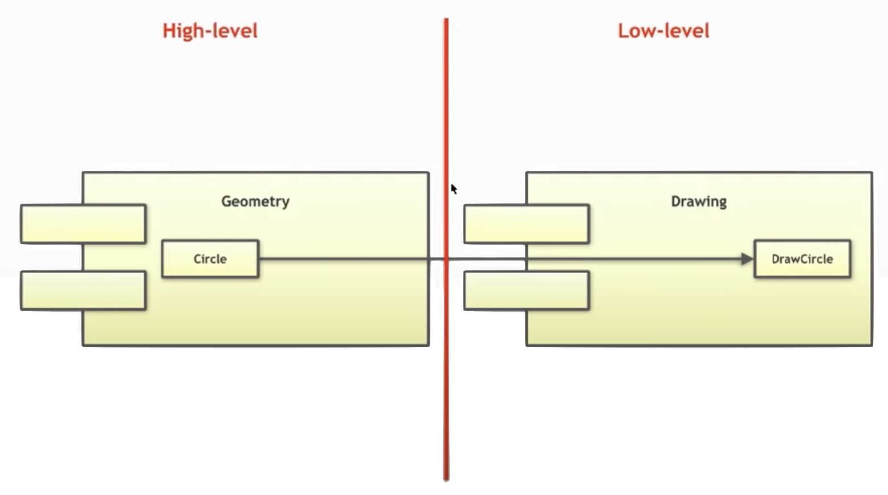
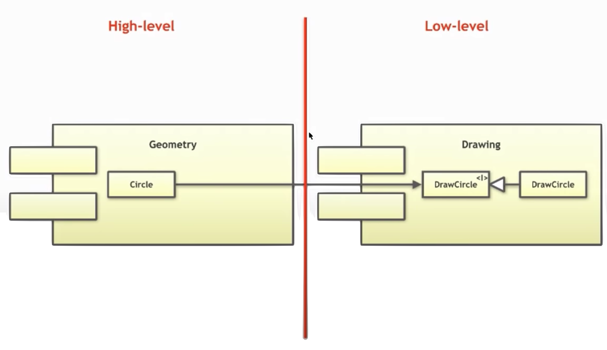
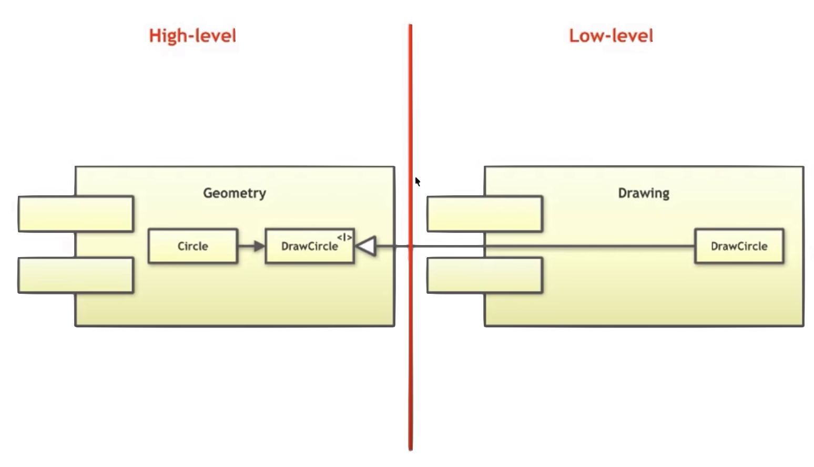

<!-- size: 16:9 -->
<!-- theme: default -->

<style>
h1 {
  text-align: center;
}
h2 {
  color: darkblue;
  text-align: center;
}
</style>

# DISEÑO DE SISTEMAS SOFTWARE

 
<style scoped>
h2 {
  text-align: left;
}
</style>


## Bloques

1. Principios de diseño OO
2. Patrones de diseño
3. Arquitectura de software

---

# ARQUITECTURA DE SOFTWARE 

---

## Índice de contenidos

1. Introducción
2. Componentes software
3. Modelado de arquitecturas
4. **Principios arquitectónicos**
5. Patrones de arquitectura

---

## Principios de Diseño Arquitectónico
---


### Principios de diseño SOLID
- __Single Responsibility Principle__: A class should only have a single responsibility, that is, only changes to one part of the software's specification should be able to affect the specification of the class.

- __Open–Closed Principle__: Software entities ... should be open for extension, but closed for modification.

- __Liskov Substitution Principle__: Objects in a program should be replaceable with instances of their subtypes without altering the correctness of that program. 

- __Interface Segregation Principle__: Many client-specific interfaces are better than one general-purpose interface.

- __Dependency Inversion Principle__: One should depend upon abstractions, [not] concretions.

---

### Implicaciones de SOLID en Arquitectura
- __Single Responsibility Principle__: Un módulo debería ser solo responsable de uno y solo un actor o stakeholder. 

- __Open–Closed Principle__: El comportamiento de un artefacto software debe ser extensible sin tener que modificarlo. 

- __Liskov Substitution Principle__: Inicialmente vinculado a la *herencia* de clases, se considera más ligado a la acción de remplazar las implementaciones de interfaces (locales o remotas). 

- __Interface Segregation Principle__: No depender de módulos que contienen más de lo que se necesita. Depender de algo que trae "equipaje" innecesario puede ser origen de problemas.

- __Dependency Inversion Principle__: Es importante no mencionar nunca el nombre de algo concreto y volátil en el código, sino referirse solo a abstracciones.

---

#### SRP en arquitectura

_**Lectura recomendada**_: Bob Martin: [Clean Architecture](bibliografia.html#cleanarch), chapter 7

> _A module should be responsible to one, and only one, user / stakeholder / **actor**._
> ––Robert C. Martin (2018): [Clean Architecture: A Craftsman's Guide to Software Structure and Design](bibliografia.html#cleanarch). 

- No malinterpretar SRP como "cada módulo debe hacer una sola cosa"


---

#### OCP en arquitectura

_**Lectura recomendada**_: Bob Martin: [Clean Architecture](bibliografia.html#cleanarch) chapter 8

> _The behavior of a software artifact ought to be extendible, without having to modify that artifact._
> ––Robert C. Martin (2018): [Clean Architecture: A Craftsman's Guide to Software Structure and Design](bibliografia.html#cleanarch). 

- A nivel arquitectónico, la aplicación de OCP separa las funcionalidades a partir de cómo, por qué y cuándo éstas pueden cambiar, y luego organiza cada funcionalidad separada en una jerarquía de componentes.
- Los componentes de mayor nivel en la jerarquía deben quedar protegidos de los cambios en los componentes de nivel inferior.


---

#### LSP en arquitectura

_**Lectura recomendada**_: Bob Martin: [Clean Architecture](bibliografia.html#cleanarch) chapter 9

En OO, el principio LSP nació ligado al uso de la **herencia** para el diseño software.
Hoy día, se considera más ligado al diseño de **interfaces** e **implementaciones**. Por ejemplo:

- Una interfaz Java implementada por varias clases
- Varias clases Ruby con las mismas signaturas
- Un conjunto de servicios con la misma interfaz ReST

LSP es aplicable porque habrá usuarios que dependan de interfaces bien definidas y de poder sustituir las implementaciones de estas interfaces.

---

#### ISP en arquitectura

_**Lectura recomendada**_: Bob Martin: [Clean Architecture](bibliografia.html#cleanarch) chapter 10

- Es pernicioso depender de módulos que contienen más de lo que se necesita. Esto es cierto también a nivel arquitectónico
- Depender de algo que trae "equipaje" que no se necesita puede ser origen de problemas.
  
ISP a nivel arquitectónico lo veremos en CRP...


---

#### DIP en arquitectura

_**Lectura recomendada**_: Bob Martin: [Clean Architecture](bibliografia.html#cleanarch) chapter 11

Los sistemas más flexibles son aquellos en que las dependencias en el código fuente se refieren solo a abstracciones y no a cosas concretas.


###### Ejemplo de DIP: factorías


**Inversión de control**: las dependencias están invertidas con respecto al flujo de control

---

##### Ejemplo de DIP en arquitectura


---

##### Ejemplo de DIP en arquitectura



---

##### Ejemplo de DIP en arquitectura


---

##### Ejemplo de DIP en arquitectura



---

##### Ejemplo de DIP en arquitectura



---

##### Ejemplo de DIP en arquitectura: patrón MVC


---

##### Ejemplo de DIP en arquitectura: patrón MVC


---

##### Ejemplo de DIP en arquitectura: patrón MVC


---

##### Ejemplo de OCP y DIP en arquitectura (diagrama UML de componentes)


---

##### Ejemplo de OCP y DIP en arquitectura (diagrama UML de clases)


---

##### Ejemplo de violación de LSP en arquitectura 

- Un servicio agregador de taxis (uber, cabify, mitaxi, acme, etc.)
- La URI con que se llama al taxi se guarda en la base de datos en formato ReST:
    `mitaxi.com/driver/Bob`
- El agregador añade la información de pedido y hace PUT a la URI:
    ```text
    mitaxi.com/driver/Bob
      /pickupAddress/24 Maple St.
      /pickupTime/153
      /destination/ORD
    ```
- Todos los taxis de diferentes compañías deben cumplir la misma interfaz ReST.
- La compañía ACME resulta que abrevia el destino en la URI con `dest`

---

- Ahora la petición hay que construirla siguiendo una reglas distintas para cada conductor:
    `if (driver.getDispatchUri().startsWith("acme.com")) ...`

- Pero meter "`acme.com`" en el código puede ser origen de fallos y brechas de seguridad. Aún peor: ACME compra a MiTaxi y unifica los sistemas informáticos.

- Las interfaces de los servicios ReST no son sustituibles, por lo que la mejor opción es definir un módulo adicional que decide el formato en función de la URI:

 URI   |  Dispatch format
:-------------------------:|:-------------------------:
`acme.com` | `pickupAddress/%s/pickupTime/%s/dest/%s`
`*.*`      | `pickupAddress/%s/pickupTime/%s/destination/%s`

---


### Principios de Cohesión y Acoplamiento de Componentes


- **REP**: _Reuse/Release Equivalence Principle_ (Cohesión)
- **CRP**: _Common Reuse Principle_ (Cohesión)
- **CCP**: _Common Closure Principle_ (Cohesión)
- **ADP**: _Acyclic Dependencies Principle_ (Acoplamiento)

---

#### Principio REP: Equivalencia de Reutilización/Entrega

> _The granule of reuse is the granule of release. Either all of the classes inside the package are reusable, or none of them are. Only components that are released through a tracking system can be effectively reused._
>
> **Robert C. Martin**

- ¿Se reutiliza código cuando se hace copia-pega? ¡No! Se reutiliza código si y sólo si no hace falta mirar el código fuente más allá de la parte pública del componente (ficheros de cabecera, etc.)

- Un cliente de una biblioteca liberada lo es __de toda la biblioteca__, no de parte de ella. Por ello, el **grano de reutilización** no puede ser menor que el **grano de entrega**

- El autor debe **distribuir/hacer entregas** regulares de distintas **versiones** del componente/biblioteca.

---
<!--
- Estrategias **DevOps** para 
  - [continuous integration](https://en.wikipedia.org/wiki/Continuous_integration)
  - [continuous delivery](https://en.wikipedia.org/wiki/Continuous_delivery) 
  - [continuous deployment](https://en.wikipedia.org/wiki/Continuous_deployment)
-->

- Hay muchas herramientas de gestión de componentes y sus dependencias con las que poder reutilizar las **bibliotecas** y **frameworks** creados por otros

  - Maven, para el lenguaje Java  
  - NPM, para el lenguaje Javascript
  - Conan, para el lenguaje C/C++
  - NuGet, para el entorno .NET de Microsoft
  - PyPi, para el lenguaje Python
  - RubyGems, para el lenguaje Ruby

<!--
- El código a reutilizar se debe tratar como un __producto__ en sí mismo, que no es mantenido ni distribuido por el consumidor o cliente, sino por el autor (o alguien delegado) responsable.
- No se puede reutilizar algo que no haya sido liberado/entregado.
-->

---

#### Principio CRP: Reutilización en Común

> _Don’t force users of a component to depend on things they don’t need._
> _The classes in a package are reused together. If you reuse one of the classes in a package, you reuse them all._
>
> No obligar a los usuarios de un componente a depender de cosas que no necesitan.
> **Robert C. Martin**

- Cuando alguien decide usar un componente, se crea una dependencia __sobre todo el componente__.

- No es bueno tener que re-validar una aplicación porque hay que liberar o entregar una versión del componente provocada por cambios hechos en clases que no importaban.
- CRP dice más sobre qué clases _no deben_ ir juntas que sobre las que _deben_ ir juntas.

---

##### CRP como la versión genérica de ISP

- ISP aconseja no depender de interfaces con métodos que no usemos
- CRP aconseja no depender de componentes que tengan clases que no usemos

Supongamos que un sistema $S$ quiere incluir un framework $F$ y que los creadores de $F$ lo han acoplado a una base de datos $D$:

$S \rightarrow F \rightarrow D$

Si $D$ contiene características que $F$ no usa y que a $S$ tampoco le interesan;

- los cambios en esas características de $D$ forzarán un redespliegue de $F$ y de $S$;
- los fallos en $D$ causarán fallos en $F$ y $S$.

Depender de algo que trae "equipaje" que no se necesita puede ser origen de problemas.

---
#### Principio CCP: Clausura Común

> Reunir en componentes aquellas clases que cambian por los mismos motivos y al mismo tiempo. Separar en componentes distintos aquellas clases que cambian en momentos distintos y por motivos diferentes.
>
> **Robert C. Martin**

- Si hay que cambiar el código, ¿dónde es mejor que estén los cambios? ¿en un mismo componente, o repartidos por varios componentes? Intentar tener junto todo lo que es probable que cambie por una misma razón.

- Está relacionado con los principios SRP y OCP

- Como no es posible garantizar al 100% el _cierre_ de OCP $\implies$ el _cierre_ debe ser estratégico $\implies$ diseñar los sistemas para que estén **cerrados** a los **cambios más probables** que podamos anticipar.


<!--
- CCP amplía la estrategia de cierre, juntando en un mismo componente todas las clases **cerradas** para un mismo tipo de cambios.


#### Tensión entre principios de cohesión de componentes

- REP y CCP son _inclusivos_: incrementan el tamaño de los componentes
- CRP es _exclusivo_: reduce el tamaño de los componentes


Cada arco describe el coste de abandonar el principio del vértice opuesto:

- ¿Hay demasiados componentes cambiando al mismo tiempo? $\implies$ consolidar mejor las clases (CCP)
- ¿Hay demasiadas versiones/entregas? $\implies$ minimizar las dependencias (CRP)
- ¿Es difícil reutilizar el código? $\implies$ mejorar los artefactos que se liberan (REP)

La postura en el _triángulo de tensiones_ debe ser coyuntural, pues las preocupaciones del equipo de desarrollo pueden cambiar con el tiempo.

- CCP es más importante que REP al principio de un desarrollo (cuando liberar es más importante que reutilizar) - YAGNI

-->


---

#### Principio ADP: Dependencias Acíclicas

> _There must be no cycles in the component dependency graph_
>
> **Robert C. Martin**

- El grafo de dependencias entre components debe ser un DAG (_Directed Acyclic Graph_)

- Hay que particionar el entorno de desarrollo en componentes "liberables" por separado.

- Varios equipos de trabajo distribuidos pueden hacer cambios a cada componente por separado, lo que puede inducir nuevas dependencias entre componentes 
  $\implies$ Hay que __gestionar__ la estructura de dependencias de los componentes

---
##### Ejemplo: estructura de un sistema (diagrama **sin ciclos**)


---
- ¿A quién afecta la liberación de una nueva versión de `Presenters` por sus responsables? \
    Solo `Main`y `View` se ven afectadas

- ¿A quiénes afecta la ejecución de un test unitario en `Presenters`? \
    `Interactors` y `Entities` (deberían ser _mocked_)

- ¿En qué orden se libera una nueva versión del sistema? 
`Entities`, `Database` 
`Interactors`, `Authorizer` 
`Presenters`, `View` & `Controllers`
`Main`


---
##### Ejemplo: estructura de un sistema (diagrama **con ciclos**)

- Un cambio de requisitos fuerza a introducir una nueva dependencia entre la clase `Entities::User` y la clase `Authorizer::Permissions`


---
###### Problemas:

- Los desarrolladores de `Database` saben que para liberarla, deben hacerla compatible con `Entities`
- Pero ahora `Database` depende también de `Authorizer` y de `Interactors`

:one: $\implies$ ahora `Database` es mucho más difícil de **liberar**, porque:

- Los cambios que haga cualquier responsable de alguno de estos tres componentes afectarán al resto

:two: $\implies$ el desarrollo de **pruebas** es más difícil:

- si se quiere probar `Entities`, antes hay que construir e integrar `Authorizer` y `Interactors` (más _mocks_!)

---
###### Ruptura de ciclos:

Dos posibles soluciones:

1. Aplicar DIP y hacer cumplir ADP
    - Crear una interfaz con los métodos que necesita la clase `User`
    - Incluir la interfaz en `Entities`
    - Heredar de la interfaz desde `Authorizer`


---
2. Aplicar OCP y hacer que se cumpla CCP 
    - Crear un componente nuevo `Permissions`
    - Hacer que `Authorizer` y `Entities` dependan de `Permissions`


<!--
La segunda alternativa puede provocar _jitters_ (lo que hacen los _gremlins_) en presencia de requisitos cambiantes: la estructura de dependencia _jitters and grows_

-->
